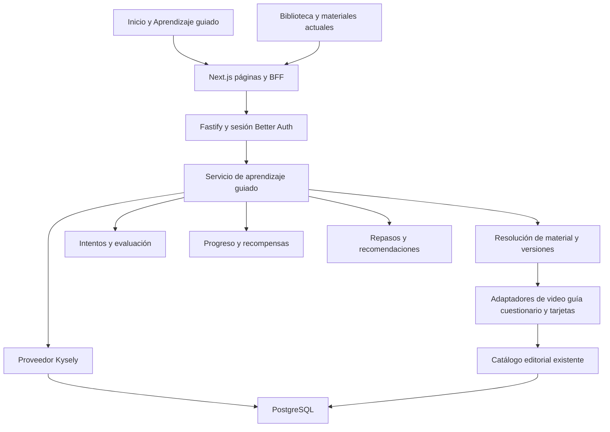

# Plan de implementación de Aprendizaje guiado

Documento de producto, educación, experiencia de usuario y arquitectura para CEDIAH / Koraz.

**Destinatario:** GPT 5.6 Sol, responsable de la implementación posterior.  
**Fecha:** 5 de septiembre de 2026.  
**Versión:** 1.0.  
**Base inspeccionada:** revisión Git `caed868` y archivos de trabajo disponibles en esa fecha.  
**Estado:** especificación para programar. Las tablas, servicios, endpoints y pantallas descritos como nuevos todavía no están implementados.

## 1 Propósito y resultado esperado

Construir un producto central de la plataforma que permita elegir un tema, entender qué estudiar, realizar actividades útiles y retomar el aprendizaje con el progreso guardado. La experiencia debe funcionar especialmente bien en teléfonos y conservar su calidad en escritorio.

La propuesta es una **ruta flexible por objetivos**, con actividades breves de comprensión, recuperación y comprobación, seguida de repasos espaciados. El orden constituye una recomendación. El estudiante puede abrir cualquier actividad disponible, cambiar de material, repetir, omitir, pausar y continuar cuando quiera. Los requisitos académicos orientan la recomendación; no bloquean lecciones.

El inicio mostrará primero el progreso de una ruta elegida y las siguientes tareas útiles, ordenadas por prioridad. El sistema debe poder responder tres preguntas sin una explicación extensa: **qué he avanzado, qué conviene hacer ahora y cómo continúo**.

El producto distinguirá tres señales: avance de la ruta, evidencia de comprensión y constancia. Ver un video suma avance; responder correctamente aporta evidencia; estudiar en distintos días muestra constancia. Ninguna de estas señales sustituye a las otras.

### Objetivos verificables

| ID | Objetivo | Evidencia necesaria |
| --- | --- | --- |
| O1 | Encontrar y comenzar una ruta con facilidad | Desde Inicio, seleccionar tema e iniciar una actividad sin tutorial obligatorio |
| O2 | Conservar la autonomía | Cualquier actividad accesible puede abrirse sin completar las anteriores |
| O3 | Hacer visible el progreso real | Contadores y porcentajes coinciden con la base de datos después de recargar e iniciar sesión en otro dispositivo |
| O4 | Recomendar tareas útiles | Prioridad reproducible, motivo legible y enlace directo a cada tarea |
| O5 | Favorecer comprensión y recuerdo | Cuestionarios con corrección, objetivos vinculados a preguntas y repasos programados |
| O6 | Crear satisfacción por avanzar | Cierre breve de actividad, hitos y meta semanal voluntaria, sin pérdida de logros por ausentarse |
| O7 | Ofrecer una interfaz profesional | Cumplimiento del contrato visual y pruebas de uso móvil de este documento |
| O8 | Permitir evolución editorial | Rutas versionadas, contenido exclusivo y adaptadores para futuros materiales |
| O9 | Mantener la arquitectura existente | Next.js → Fastify → Kysely → PostgreSQL; identidad con Better Auth |

### Límites de esta entrega de planificación

Este documento no ejecuta migraciones, no modifica funcionalidad de la aplicación ni publica contenido. Incluye decisiones predeterminadas para que Sol pueda desarrollar sin volver a consultar elecciones rutinarias. Las fórmulas, puntos e intervalos propuestos son parámetros iniciales de producto que deben evaluarse con uso real; no son una medición clínica ni una garantía de retención.

## 2 Lectura del documento y contrato de ejecución

Sol debe leer primero las secciones 3, 4, 6, 9 y 19. Antes de programar persistencia, debe leer completas las secciones 10 a 16. La interfaz se rige por las secciones 7 y 8; la finalización, por las secciones 20 y 21.

1. Trabajar por fases con una porción funcional verificable en cada una.
2. Mantener un registro en `docs/aprendizaje-guiado/ESTADO.md` con fase, archivos, migraciones, pruebas, decisiones y siguiente acción.
3. Comprobar el estado actual del repositorio antes de cada fase: pueden existir cambios posteriores a esta planificación.
4. No reemplazar trabajo ajeno ni convertir una refactorización local en un rediseño global.
5. No considerar terminado un flujo porque se vea correcto con datos ficticios. Debe funcionar con la API y persistencia reales de desarrollo.
6. No añadir modelos de IA, vectores, microservicios ni colas para producir recomendaciones en V1. Las reglas descritas son deterministas y suficientes para empezar.
7. No desplegar producción ni anunciar una ruta académica como lista por el solo hecho de terminar el código. La habilitación requiere las comprobaciones técnicas y editoriales de lanzamiento.

## 3 Estado real de la plataforma

Los siguientes hallazgos proceden del código local. No se consultó la base de producción ni se verificó cuántos materiales académicos utilizables existen hoy. La migración histórica del catálogo no constituye un inventario actual. Sol debe obtener un inventario editorial de solo lectura al comenzar y no presentar los ejemplos de este documento como contenido existente.

| Área | Hallazgo | Consecuencia para la implementación |
| --- | --- | --- |
| Web | Next.js 16.2.12, React 19.2.8, TypeScript; App Router | Mantener este stack y las versiones fijadas salvo necesidad demostrada |
| API | Fastify 5.11.0, Kysely 0.29.5, Zod 4.4.3 | Registrar un módulo de rutas nuevo e inyectar su proveedor como los existentes |
| Identidad | Better Auth 1.7.2 y tablas `public.auth_users` | Derivar siempre el usuario de la sesión verificada |
| Infraestructura | PostgreSQL administrado por Supabase y objetos S3 | Supabase es infraestructura; no introducir Supabase Auth, SDK de datos ni acceso desde el navegador |
| Migraciones | `database/migrations`, hasta `0008_content_reactions.sql` en la inspección | Crear los siguientes números libres; no usar `supabase/migrations` |
| Catálogo | `content_items` con tipos `video`, `guide`, `quiz`, `flashcards`, `topic`; contenido JSONB y versión entera | Reutilizar publicaciones y añadir metadatos/identificadores compatibles |
| Clasificación | Asignaturas con IDs; `topic` y `regions` contienen texto; hay publicaciones de tipo `topic` | La ruta necesita una identidad estable de tema, no un filtro textual como única relación |
| Prácticas anexas | Video y guía pueden proyectar las mismas preguntas como cuestionario y flashcards | Resolver una fuente canónica y evitar duplicación de evidencia y de contenido |
| Identidad de preguntas | `QuizQuestionSchema` y `FlashcardSchema` no tienen IDs persistentes | Añadir IDs antes de guardar respuestas o programar tarjetas |
| Corrección actual | Cuestionarios anexos calculan puntuación en el cliente; reciben `correctOptionIndex` | El nuevo motor debe corregir en servidor y separar el DTO del estudiante |
| Progreso de práctica | Estados locales como `score`, `finished`, `mastered` en `content-detail-screen.tsx` | Extraer reproductores reutilizables y conectarlos a intentos persistentes |
| Progreso de cursos | `courses`, `course_modules`, `lessons`, `enrollments`, `lesson_progress` | Conservar el dominio de cursos; no encajar forzosamente rutas multimaterial en `watched_seconds` |
| API de aprendizaje | `/v1/learning/dashboard` y actualización de progreso de lección | Mantener compatibilidad; añadir un subdominio `/v1/guided-learning` |
| Inicio | Prioriza accesos por formato, videos recientes y destacados | Insertar progreso y pendientes antes del descubrimiento de contenido |
| Navegación | Shell persistente en `app-shell.tsx`, reconocimiento en `platform-routes.ts` | Actualizar ambos, incluyendo selección activa y navegación móvil |
| Diseño | Tokens Koraz, Poppins local e iconos Phosphor | Reutilizar la identidad visible; no cambiar nombre o logotipo por diferencias con el README |
| Material privado | URLs firmadas de corta duración; videos externos se abren fuera del reproductor | No persistir URLs firmadas ni interpretar un clic externo como visualización completa |

### Archivos existentes que Sol debe leer

Rutas relativas a la raíz del repositorio, incluidas como localizadores para ejecución:

- `README.md`, `docs/architecture.md`, `docs/contributing.md`, `docs/security.md`, `database/README.md`.
- `packages/contracts/src/index.ts`.
- `apps/api/src/app.ts`, `apps/api/src/db/database.ts`, `apps/api/src/config.ts`, `apps/api/src/content-authorization.ts`.
- `apps/api/src/providers/postgres-learning.ts`, `postgres-content.ts`, `postgres-subjects.ts`.
- `apps/web/src/components/app-shell.tsx`, `platform-frame.tsx`, `authenticated-app-layout.tsx`, `dashboard-screen.tsx`.
- `apps/web/src/components/content-detail-screen.tsx` y `content-studio.tsx`.
- `apps/web/src/lib/content-practice-links.ts`, `content-guide-links.ts`, `content-editing.ts`, `study-progress.ts`.
- `apps/web/src/lib/server/learning-dashboard.ts`, `content-api.ts`, `api-session.ts`.
- `apps/web/src/lib/platform-routes.ts`, `request-origin.ts`, `use-dialog-focus.ts`, `use-body-scroll-lock.ts`.
- `apps/web/src/app/koraz-theme.css` y `apps/web/src/app/layout.tsx` para confirmar orden de estilos.
- Pruebas existentes de learning, contratos, autorización, prácticas compartidas y migraciones PostgreSQL/PGlite.

Al inspeccionar había cambios ajenos en `auth-paper.css`, `koraz-theme.css`, `landing-paper.css`, `dashboard-screen.tsx`, `subject-detail-screen.tsx` y `subject-directory-screen.tsx`. Esa lista es una advertencia de coordinación, no una prohibición de modificar los puntos de integración necesarios; revisar el diff vigente y preservar sus cambios.

## 4 Estrategia educativa

### Fundamento y decisiones de producto

La práctica de recuperación y el estudio distribuido tienen respaldo en investigación sobre aprendizaje. Por eso la ruta alterna materiales explicativos con preguntas y vuelve a proponer práctica después de un intervalo. La relectura puede servir como apoyo, pero completar lecturas por sí solo no demuestra comprensión. Véase [Dunlosky y colaboradores, 2013](https://acs.ist.psu.edu/ist521/dunloskyRMNW13.pdf).

Responder preguntas también puede contribuir al aprendizaje, además de medirlo; la evidencia experimental sobre el efecto de las pruebas justifica ofrecer intentos formativos con explicación y oportunidades posteriores de recuperar la información. Véase [Roediger y Karpicke, 2006](https://pubmed.ncbi.nlm.nih.gov/16507066/).

La autonomía y la percepción de competencia orientan el diseño motivacional: dar elecciones comprensibles, mostrar avances verificables y permitir detenerse. La teoría de autodeterminación sirve de fundamento general, no de validación automática de esta gamificación. Véase [Ryan y Deci, 2020](https://selfdeterminationtheory.org/wp-content/uploads/2020/06/2020_RyanDeci_IntrinsicandExtrinsic.pdf).

Lo que sigue es la propuesta específica de producto: tamaños de sesión, secuencias, umbrales y puntos iniciales. Se deberán ajustar con resultados y revisión educativa, sin atribuir esas cifras exactas a los estudios.

### Unidad educativa

Una ruta contiene unidades. Cada unidad resuelve un pequeño conjunto de objetivos observables: identificar, relacionar, explicar, diferenciar o aplicar. Evitar objetivos vagos como «comprender todo el tórax». Las rutas de lanzamiento deberían tener aproximadamente 3 a 6 unidades; las actividades deberían poder realizarse generalmente en 3 a 12 minutos. Son criterios editoriales, no límites de acceso.

Cada unidad recomienda:

| Momento | Material | Comportamiento |
| --- | --- | --- |
| Orientarse | Título y 1 a 3 objetivos | Mostrar qué podrá hacer el estudiante; diagnóstico corto opcional de la ruta |
| Comprender | Video o guía | Elegir el formato principal; ofrecer el otro como alternativa o apoyo, si cubre el mismo objetivo |
| Recordar | Flashcards | Intentar responder antes de revelar; registrar valoración por tarjeta |
| Comprobar | Cuestionario | Responder sin solución previa, recibir explicación y enlace al fragmento relevante |
| Relacionar | Cuestionario con relaciones o aplicación, si existe | Evitar que todas las preguntas sean reconocimiento literal |
| Consolidar | Repaso posterior | Recuperar preguntas o tarjetas después de un intervalo, mezclando unidades ya estudiadas |

No es obligatorio tener todos los formatos en cada unidad. Una guía con práctica y comprobación puede constituir una unidad válida. Un recurso faltante no se sustituye por un botón vacío. Video y guía solo serán alternativas equivalentes cuando el editor confirme que cubren el mismo objetivo; de lo contrario son pasos distintos o un complemento opcional.

### Diagnóstico y personalización

Al iniciar se ofrecen tres elecciones breves: tema, «Desde cero / Ya conozco algo» y tiempo orientativo de sesión (5, 10 o 20 minutos; valor inicial 10). La experiencia permite comenzar inmediatamente y configurar después. Una fecha de examen es opcional y permanece en ajustes, no como requisito de entrada.

El diagnóstico es opcional, dura aproximadamente 3 a 5 preguntas y solo usa material disponible y revisado. Con pocas preguntas orienta la primera recomendación; no concede dominio ni completa automáticamente toda una unidad. Puede sugerir «Empieza por la práctica» y mantener accesibles los materiales explicativos.

La personalización de V1 utiliza: evidencias recientes, repasos pendientes, actividad interrumpida, prioridad editorial, tiempo elegido y ruta fijada. No necesita inferir estilos de aprendizaje ni etiquetar al usuario como «visual» o «auditivo».

### Errores como parte del aprendizaje

Un error produce una explicación breve y un enlace específico al video, sección de guía o recurso asociado. La pantalla muestra «Refuerza este punto» y ofrece continuar. Repetir de inmediato la misma pregunta sirve para practicar, pero no aumenta artificialmente la evidencia independiente.

El cuestionario debe poder terminarse con cualquier resultado. La finalización suma avance. Los resultados bajos generan recomendaciones de refuerzo sin bloquear el resto del tema. Si faltan explicaciones útiles o preguntas suficientes, el editor verá una brecha de calidad; el estudiante no verá una afirmación de dominio sin respaldo.

### Ejemplo de una ruta

**Ejemplo estructural, sujeto a inventario y revisión académica:** «Anatomía del corazón».

| Unidad | Objetivo resumido | Secuencia recomendada |
| --- | --- | --- |
| Ubicación y relaciones | Identificar posición y relaciones principales | Video o guía equivalente → 5 tarjetas → cuestionario breve |
| Cavidades y válvulas | Relacionar estructuras con el recorrido sanguíneo | Guía o video → tarjetas → preguntas de relaciones |
| Vasos principales | Diferenciar trayectos y conexiones | Material explicativo → recuperación → comprobación |
| Integración | Conectar lo estudiado en situaciones de aplicación | Cuestionario mixto → revisión de errores |

La ruta podría tener 12 pasos esenciales. Completar 7 muestra «7 de 12 actividades · 58 %». Si se omite una y se abre directamente la última, esa actividad sigue accesible. Repetir un paso no aumenta el denominador ni vuelve a otorgar sus puntos de primera finalización.

## 5 Alcance de versiones

### V1 completa antes de promoción comercial

Incluye descubrimiento de rutas, inscripción voluntaria, detalle visual, elección libre, cuatro reproductores persistentes, progreso en Inicio, cola de pendientes, repasos por tarjeta/pregunta, objetivos con evidencia, XP e hitos discretos, meta semanal opcional, editor de rutas, publicación versionada, material exclusivo, permisos, accesibilidad y recuperación ante errores de red.

Una primera fase puede contener solo una ruta y un formato para probar de extremo a extremo. Esa fase es un hito técnico, no la entrega comercial completa.

### Evolución posterior

Nuevos adaptadores para casos, imágenes interactivas, audio, simulación o tareas manuales; algoritmos de espaciado calibrados; notificaciones voluntarias; descarga de material; analítica editorial avanzada; rutas con mentor; acceso comercial específico si el negocio lo define.

V1 no requiere rankings, vidas, monedas, castigos por inactividad, certificados de competencia clínica, tutor generativo, notificaciones push, pagos nuevos ni estudio completo sin conexión. La ampliación futura no debe exigir reemplazar el núcleo de progreso.

## 6 Navegación y flujos

### Arquitectura de información

| Ubicación | Ruta web propuesta | Función |
| --- | --- | --- |
| Inicio existente | `/dashboard` | Progreso destacado y pendientes antes de los materiales recientes |
| Sidebar principal | `/aprendizaje` | Entrada «Aprendizaje guiado», inmediatamente después de Inicio |
| Resumen de aprendizaje | `/aprendizaje?tab=hoy` | Ruta fijada, pendientes y sesión sugerida |
| Rutas | `/aprendizaje?tab=rutas` | Mis rutas y exploración por tema/asignatura |
| Progreso | `/aprendizaje?tab=progreso` | Avance, objetivos, constancia e hitos |
| Detalle de ruta | `/aprendizaje/rutas/[slug]` | Resumen, unidades y actividades accesibles |
| Actividad de ruta | `/aprendizaje/rutas/[slug]/actividades/[stepId]` | Resolución contextual de opción, intento y regreso a la ruta |
| Sesión persistente | `/aprendizaje/sesiones/[attemptId]` | Retomar un intento o repaso, incluso tras recargar |
| Editor | `/panel/rutas` y `/panel/rutas/[pathId]` | Crear, revisar, publicar y versionar rutas |

Añadir `/aprendizaje` a `isPlatformPath` y sus pruebas, a la resolución de `activeKey` del shell y a los layouts autenticados. Las páginas nuevas usan `AuthenticatedAppLayout`; ocultar un enlace no sustituye autorización. El editor debe resolver su sección antes del caso genérico `/panel`.

En teléfono se conserva el menú móvil global existente. Dentro de Aprendizaje guiado hay tres pestañas: **Hoy, Rutas, Progreso**. No introducir una segunda barra inferior global que compita con el menú y los controles de la actividad. Mantener pestaña, filtros y regreso mediante URL, sin depender exclusivamente de estado React.

### Primer uso

1. Inicio muestra una tarjeta breve «Aprende con una ruta» y el botón «Elegir tema».
2. El catálogo presenta temas con título, imagen útil, duración aproximada y unidades; no tarjetas saturadas de métricas.
3. La ficha permite «Comenzar ruta», ver unidades y ajustar el tiempo orientativo. La inscripción ocurre solo al confirmar comenzar.
4. Se recomienda la primera actividad, o diagnóstico si el usuario lo elige. «Ver todas las actividades» está disponible.
5. Tras completar una actividad se confirma el guardado y se ofrecen «Continuar» y «Volver a mi ruta».

### Uso recurrente

Inicio abre con el progreso de la ruta fijada; si no existe, la última ruta activa con actividad reciente. Hay un selector compacto para cambiar. Debajo aparecen hasta tres pendientes ordenados. «Ver pendientes» abre la cola completa. Una actividad reanudable conserva posición o respuesta ya guardada. El cierre devuelve a la posición de la ruta desde la que se abrió.

### Pausar y omitir

Pausar una ruta retira sus tareas de Inicio sin borrar historial. Las tareas de una misma tarjeta siguen activas si pertenecen también a otra ruta activa. Reanudar recalcula recomendaciones desde evidencias y fechas guardadas; agrupa el atraso en sesiones pequeñas.

«Omitir por ahora» evita insistir sobre un paso; se puede restaurar desde la ruta. Un paso esencial omitido sigue pendiente a efectos del porcentaje y figura como «Omitida» de forma neutral. No aparece un 100 % por omitir actividades. La persona puede abandonar o archivar una ruta conservando sus logros.

## 7 Contrato visual e interacción

La dirección visual es una plataforma académica contemporánea: superficies claras, contraste limpio, tipografía legible, ilustración anatómica pertinente y acentos de la identidad Koraz. La gamificación se expresa en avance, conexiones entre unidades, hitos y microinteracciones; no exige personajes ni estética infantil.

### Composición móvil de Inicio

Esquema funcional de referencia; las cifras son de ejemplo:

```text
┌──────────────────────────────────┐
│ Menú   Inicio          Perfil    │
│                                  │
│ Tu aprendizaje                   │
│ Anatomía del corazón        ˅    │
│ 58 %      7 de 12 actividades     │
│ ███████████░░░░░░░░░             │
│ [ Continuar mi ruta          → ] │
│                                  │
│ Para hoy              Ver todo   │
│ Repasar válvulas             →   │
│ Repaso recomendado · 5 min       │
│                                  │
│ Terminar vasos principales   →   │
│ Donde lo dejaste · 6 min         │
│                                  │
│ Comprobar cavidades          →   │
│ Siguiente paso · 4 min           │
│                                  │
│ Esta semana      ● ● ○  2/3 días │
│ Materiales y videos recientes    │
└──────────────────────────────────┘
```

El porcentaje y su significado deben verse juntos. Usar una sola barra o un anillo, sin duplicar ambos en la misma tarjeta. Si hay tareas de varias rutas, cada fila incluye el tema; evitar repeticiones cuando todas pertenecen al mismo.

«Continuar mi ruta» abre la actividad reanudable de esa ruta o su siguiente paso. El primer pendiente puede ser un repaso más urgente y tendrá su propio enlace. Los verbos explican esa diferencia sin dos botones idénticos que lleven a destinos distintos.

### Composición de una ruta

```text
← Mis rutas          Anatomía del corazón
58 % · 7 de 12 actividades          Opciones

[ Mi ruta ] [ Materiales ] [ Mi progreso ]

✓ Ubicación y relaciones                 3/3
  Unidad completada

◉ Cavidades y válvulas                    2/3
  ✓ Comprender cavidades     Video o guía
  ✓ Recordar estructuras     Flashcards
  → Comprobar relaciones     Cuestionario 4 min

○ Vasos principales                       1/3
  Abrir unidad

○ Integración                             1/3
  Abrir unidad
```

Representar unidades en una línea vertical y tarjetas expandibles. No usar un mapa horizontal que obligue a arrastrar. La unidad actual se abre inicialmente; las demás se expanden por decisión del estudiante. Los nodos futuros muestran disponibilidad, no candados académicos. «Recomendado» indica el siguiente paso, sin confundirlo con requisito de acceso.

### Actividad

Cabecera compacta: volver, título, posición («Pregunta 2 de 5») y estado de guardado cuando corresponda. El contenido ocupa la mayor parte de la pantalla. En cuestionarios: una pregunta por vista, opciones grandes, botón «Comprobar» y luego «Continuar». La selección por sí sola no envía la respuesta; así se evita penalizar un toque accidental.

En flashcards: pregunta → «Mostrar respuesta» → cuatro botones con palabras completas: «No la recordé», «Me costó», «La recordé», «Fue fácil». Distribuirlos en una cuadrícula 2 × 2 en teléfono. No depender del gesto de voltear ni de colores para indicar significado.

Los diálogos breves sirven para elegir formato, ajustar tiempo, posponer o pausar. El estudio prolongado y los cuestionarios viven en una página o vista de pantalla completa con URL. Reutilizar el mismo reproductor dentro de los modales existentes cuando se estudia desde la biblioteca; no abrir modales anidados.

Al terminar: check breve, «Actividad completada», avance actualizado y XP solo si hubo recompensa nueva. Mostrar dos acciones: «Continuar» y «Volver a mi ruta». Nunca iniciar automáticamente la siguiente actividad. En un resultado bajo, conservar el reconocimiento del esfuerzo y mostrar un refuerzo concreto.

### Escritorio

Mantener sidebar y ancho máximo de contenido de aproximadamente 1200 px. En Inicio: columna principal con progreso y tareas, columna auxiliar con constancia/rutas. En ruta: mapa/unidades en dos tercios y resumen contextual en un tercio, sin dispersar las actividades en muchas columnas. El estudio de preguntas tiene un ancho de lectura de aproximadamente 720 px.

La jerarquía es la misma en todos los tamaños. El orden DOM coincide con el orden móvil; no reorganizar de forma que el teclado siga una secuencia incomprensible.

### Tokens y medidas

| Elemento | Regla |
| --- | --- |
| Colores | Usar `--koraz-blue`, `--koraz-ink`, `--koraz-canvas`, `--koraz-line` y tokens semánticos nuevos con prefijo `--learning-` |
| Estados | Éxito, pendiente, en progreso, omitida y no disponible con texto e icono, además de color |
| Tipografía | Poppins existente; cuerpo 16 px y altura de línea cercana a 1.5; títulos 24–30 px en móvil |
| Espaciado | Escala 4, 8, 12, 16, 24, 32; padding lateral móvil 16 px |
| Objetivos táctiles | Objetivo de producto de 48 × 48 CSS px, separación útil de al menos 8 px |
| Tarjetas | Radio 16–20 px, borde suave, sombra ligera; no poner todo dentro de tarjetas adicionales |
| Iconos | Phosphor, tamaños y pesos coherentes; SVG decorativo con `aria-hidden` |
| Movimiento | 150–250 ms; solo opacidad/transform cuando sea posible; respetar `prefers-reduced-motion` |
| Botones | Un CTA dominante por bloque; texto con verbo y objeto; estados enviando, listo y reintentar |
| Adaptación | Comenzar en 320–430 px; tabla y escritorio a partir de espacio real disponible; conservar umbral del shell de 961 px salvo ajuste justificado |
| Zona segura | Controles inferiores respetan `env(safe-area-inset-bottom)` y no cubren la última respuesta ni el foco |

El objetivo táctil de 48 px es una decisión de producto. No confundirlo con el mínimo AA de WCAG 2.2, que tiene un criterio de 24 CSS px con condiciones y excepciones. Véase [W3C sobre tamaño mínimo de objetivos](https://www.w3.org/WAI/WCAG22/Understanding/target-size-minimum.html).

### Accesibilidad y claridad

Objetivo de conformidad WCAG 2.2 AA: contraste de texto normal 4.5:1, foco visible y no oculto, zoom y reflujo, navegación por teclado, formularios etiquetados y estados comprensibles sin color. Pestañas con semántica y teclas apropiadas; diálogos con gestión y devolución del foco, Escape y cierre visible. Progreso con texto y elemento `progress` o semántica equivalente. Anuncios `aria-live="polite"` solo para resultados relevantes, no por segundo de video. Ver [WCAG 2.2](https://www.w3.org/TR/WCAG22/).

Para materiales: videos con subtítulos y/o alternativa textual adecuada según el contenido; imágenes de preguntas con alternativas revisadas que no revelen accidentalmente la respuesta; PDFs o documentos ilegibles no deben ser el único camino esencial. Si un recurso externo no ofrece accesibilidad suficiente, ofrecer guía equivalente y registrar la brecha editorial.

### Estados obligatorios

| Estado | Presentación |
| --- | --- |
| Sin rutas | «Elige tu primer tema» y CTA; no gráficos de 0 % repetidos |
| Ruta nueva | «Comienza con…»; diagnóstico opcional |
| Cargando | Skeleton que reserva el espacio; no mostrar 0 como dato provisional |
| API no disponible | «No pudimos cargar tu progreso» y Reintentar; no sustituir con cifras ficticias |
| Guardado pendiente | Indicador discreto «Guardando…» o «Pendiente de guardar» |
| Red recuperada | «Progreso guardado» tras confirmación real del servidor |
| Sin pendientes | «Por hoy estás al día» y opción de explorar/continuar libremente |
| Atraso grande | Una sesión sugerida manejable y «Ver todos»; no docenas de alertas rojas |
| Ruta pausada | «En pausa» y «Retomar» |
| Recurso retirado | Explicar disponibilidad, ofrecer alternativa equivalente si existe; conservar historial |
| Ruta completada | Hito permanente, resumen y próximos repasos separados del 100 % de avance |
| Permiso vencido | Conservar resumen histórico propio, impedir apertura del recurso protegido y explicar cómo recuperar acceso cuando exista ese flujo |

## 8 Gamificación y métricas visibles

### Avance de ruta

Cada paso esencial tiene peso 1 en V1. Las alternativas de video/guía cuentan como **un mismo paso**, no dos. Los pasos opcionales no alteran el denominador. El denominador se fija con la versión publicada en la que se inscribió el usuario.

```text
avance = pasos esenciales completados / pasos esenciales de la versión
porcentaje = redondeo(100 × avance), limitado a 99 si queda algún paso esencial
100 % se muestra solo cuando todos los pasos esenciales están completados
```

Una ruta sin pasos esenciales no es publicable. No se resta avance por paso del tiempo, repasos pendientes, cambio de dispositivo o actualización editorial. Los intentos repetidos mantienen el avance y pueden cambiar la evidencia. «Omitir» no equivale a completar.

### Evidencia por objetivo

En el nivel principal mostrar estados textuales: **Por comprobar, En práctica, Bien encaminado, Consolidado**. Mostrar el detalle al tocar un objetivo: preguntas distintas contestadas, resultado de la comprobación más reciente y fecha del último repaso. No presentar un «83 % de conocimiento» calculado mezclando tiempo, clicks y autovaloraciones.

Reglas iniciales por objetivo, evaluadas con intentos finalizados y primera respuesta calificable de cada pregunta en cada intento:

1. `unassessed`: ninguna comprobación calificable finalizada. Las autovaloraciones de flashcards no cambian esto por sí solas.
2. `practicing`: existe evidencia, pero no cumple la cobertura/resultado de las condiciones siguientes, o el resultado calificable más reciente es inferior a 80 %.
3. `developing`: una comprobación reciente con al menos 3 preguntas canónicas distintas asociadas al objetivo y resultado de al menos 80 %.
4. `consolidated`: dos comprobaciones con esa cobertura y resultado de al menos 80 %, separadas por al menos 24 horas; entre ambas, al menos 5 preguntas canónicas distintas. La comprobación más reciente debe seguir cumpliendo el umbral.

«Reciente» significa dentro de 30 días para V1. Si transcurre ese tiempo, conservar el último estado alcanzado en el historial y mostrar «Repaso recomendado»; en el resumen de evidencia actual no contar ese objetivo como consolidado vigente. Si el banco tiene menos de 5 preguntas, permitir aprendizaje y progreso, pero no conceder Consolidado bajo estas reglas. Mostrar «Faltan preguntas para comprobar este objetivo» en edición y una descripción neutral de evidencia limitada al estudiante.

Para no inflar evidencia: la misma pregunta convertida a flashcard y cuestionario conserva identidad; una pregunta vista en la misma sesión no cuenta como un ítem independiente. Un diagnóstico orientativo y los reintentos inmediatos se etiquetan como práctica y no satisfacen la segunda comprobación diferida. Los intervalos/umbrales son configurables y se versionan como política.

### XP e hitos

| Acción | XP inicial | Clave de unicidad |
| --- | --- | --- |
| Primer paso esencial de comprensión completado | 10 | Usuario + reward_identity + versión pedagógica de la recompensa |
| Primer paso esencial de flashcards completado | 10 | Usuario + reward_identity + versión pedagógica de la recompensa |
| Primer paso esencial de cuestionario completado | 15 | Usuario + reward_identity + versión pedagógica de la recompensa |
| Repaso que aplica realmente al estado de memoria | 2 por ítem, máximo 20 XP de repaso por día del usuario | Usuario + ítem canónico + versión previa del estado de repaso |
| Unidad completada por primera vez | 20 | Usuario + unidad estable + versión pedagógica |
| Ruta completada por primera vez | 50 | Usuario + ruta + versión pedagógica |

No otorgar puntos por abrir pantallas, tiempo pasivo, cada repetición o perfección de notas. El objetivo es reconocer actividad útil y reanudación. La biblioteca no entrega puntos de pasos de ruta si el usuario no tiene una inscripción a la que se puedan aplicar; sí puede aportar evidencia reutilizable.

Si un mismo evento completa pasos equivalentes en varias rutas, entregar una sola recompensa de actividad con clave canónica de logro, no una por ruta. Los hitos de unidad/ruta sí son específicos. Mantener una clave `rewardIdentity` estable para opciones equivalentes y conservarla en revisiones cosméticas. El editor hereda esa identidad al reutilizar un paso y no puede asignar premios nuevos por copiarlo. Para opciones del mismo paso la identidad y el importe son iguales; si cambia la selección/cobertura, el validador exige una decisión explícita de equivalencia. Cuando un evento coincide con varias identidades de premio que no fueron unificadas, conceder como máximo un premio de actividad —el de mayor importe, con desempate por clave— y registrar las demás como satisfechas con XP 0 para impedir cobrarlas después. La sección 13 detalla su persistencia.

Mostrar XP como métrica secundaria con etiqueta «Puntos de aprendizaje». No añadir niveles en V1: tener avance, objetivos, XP y meta semanal ya ofrece suficientes señales. Hitos visuales iniciales: «Primera actividad», «Primera unidad», «Ruta completada» y «Volví a repasar». Se guardan una vez y sobreviven a pausas.

### Constancia

Ofrecer una meta voluntaria de 2, 3 o 5 días por semana; predeterminado sugerido 3, sin activarla hasta que el usuario elija usarla. Un día cuenta cuando hay un paso completado por primera vez o un repaso aplicado, no al iniciar sesión. Semana de lunes a domingo según zona horaria IANA guardada.

Mostrar «2 de 3 días esta semana». No quitar puntos, borrar hitos ni mostrar una racha rota como fracaso. No enviar notificaciones sin que el usuario las active. Los cambios de zona horaria o meta se hacen efectivos la semana siguiente para el cómputo de constancia; las fechas de próximos repasos se muestran inmediatamente en la zona elegida.

## 9 Arquitectura elegida

Mantener un **monolito modular** en la API. El nuevo dominio coordina contenido editorial, intentos, progreso, repasos y recompensas; no crea una aplicación separada.



El frontend presenta estado confirmado o un borrador local explícito. Fastify es autoridad de permisos, corrección, prioridad, completitud y XP. Las actualizaciones críticas se confirman en una sola transacción. PostgreSQL es la fuente persistente, con restricciones e índices que sostienen invariantes bajo concurrencia.

### Decisiones de arquitectura

| Decisión | Motivo |
| --- | --- |
| Dominio nuevo `guided-learning` | El dominio de cursos existente se centra en lecciones y tiempo visto; alterar sus significados introduciría regresiones |
| Reutilizar contenido por referencia | Permite rutas sobre el catálogo sin copiar publicaciones ni assets |
| Revisiones inmutables para ejecución | Una edición posterior no debe cambiar las preguntas o el denominador de un intento existente |
| Estado actual y eventos de negocio en PostgreSQL | Respuesta rápida, trazabilidad y reparación; no hace falta event sourcing completo |
| Recomendación calculada al consultar | Las fechas persistidas bastan; no requiere un cron para mostrar que un repaso ya toca |
| Motor de tipos mediante registro de adaptadores | Añadir un formato debe ampliar validación, renderizado y evidencias, sin reescribir progreso |
| DTOs específicos del estudiante | Evita enviar soluciones y metadatos editoriales con una pregunta sin contestar |
| Nuevas tablas privadas a través de Fastify | Coherente con Better Auth y el uso actual de PostgreSQL administrado |

No cambiar a Prisma, Firebase, Supabase Auth, React Native ni Tailwind por conveniencia del implementador. La web responsive y los estilos actuales son el entorno de trabajo. Las recomendaciones genéricas de habilidades de diseño deben adaptarse al stack y la identidad existentes.

## 10 Identidad y organización del contenido

### Tema, ruta, unidad, paso y opción

- **Tema:** identidad editorial estable. V1 vincula cada ruta a una publicación existente `content_items.kind = 'topic'`; la pertenencia se valida en servidor. Si solo hay etiquetas textuales, el administrador crea o vincula el tema en el flujo actual. Nunca crear automáticamente temas distintos por diferencias de tildes/capitalización.
- **Ruta:** producto de aprendizaje del tema, con slug estable, imagen, descripción breve y versiones.
- **Unidad:** agrupación pedagógica con objetivos estables y orden recomendado.
- **Paso:** objetivo de actividad que aporta una unidad de avance si es esencial.
- **Opción:** forma concreta de resolver el paso, como video o guía equivalente.
- **Recurso:** representación canónica de una publicación o una proyección de esa publicación.
- **Revisión de recurso:** contenido y reglas inmutables usados por una versión de ruta y sus intentos.
- **Ítem:** pregunta o tarjeta con identidad estable compartida entre proyecciones derivadas de la misma fuente.

La ruta puede tener varias opciones por paso, pero solo una recomendada por defecto. Completar cualquier opción válida satisface el paso. Si el alumno realiza otras opciones después, se registran como estudio adicional.

### Fuente canónica y proyecciones

Actualmente `findVideoLinkedGuide` elige la guía enlazada más reciente y `projectPracticeContent` reutiliza sus preguntas. El motor nuevo debe resolver lo mismo en servidor, fijar la fuente al publicar y guardar una referencia explícita. No volver a elegir «la guía más reciente» en cada intento de una ruta ya publicada.

La identidad de recurso es `(source_content_id, projection)`, donde `projection` es `video`, `guide`, `quiz` o `flashcards` en V1. Si un cuestionario y sus flashcards proceden de una guía, ambos apuntan al ID real de la guía, no al ID del video que conduce a ella. Una guía integrada sin publicación separada usa el ID del video como fuente y `projection = guide`.

La identidad de ítem debe conservarse al transformar una pregunta en flashcard. No usar el índice del array, el slug ni el texto como clave permanente. Una revisión cosmética o reordenación mantiene el ID; un cambio sustancial de significado/respuesta incrementa `memory_version`. Una pregunta nueva recibe nuevo UUID.

### Migración de IDs

Extender de manera compatible preguntas, opciones de cuestionario y tarjetas con IDs UUID. Durante la transición, los contratos de lectura aceptan IDs ausentes en contenido antiguo; el servidor los asigna una sola vez mediante backfill controlado o primera escritura editorial, y los persiste antes de publicar una ruta. No generar UUID nuevos en cada lectura.

Para conservar el shape actual, añadir `id`, `memoryVersion` y `optionIds` a cada pregunta, manteniendo `options: string[]` y `correctOptionIndex`. `optionIds` es un array paralelo de UUID con longitud igual a `options`, sin duplicados. El editor mueve/añade/elimina texto e ID juntos. En las tarjetas independientes añadir `id` y `memoryVersion`. El adaptador produce el formato normalizado `{id, text}` de las opciones para ejecución, sin obligar a convertir de golpe todos los lectores antiguos. Validar ambas representaciones en las pruebas de compatibilidad.

El backfill bloquea la fila de contenido, conserva exactamente textos/respuestas/orden y asigna solo identidades faltantes. Incrementa `content_items.version` una sola vez por fuente modificada y registra la normalización en auditoría para que una pestaña editorial vieja reciba conflicto en vez de borrar IDs. Repetir el proceso no modifica IDs, texto ni versión si ya está normalizado. Comparar el payload antes/después eliminando los campos nuevos para demostrar que no cambió el material. La escritura editorial posterior rechaza pérdida o duplicación de identidades ya existentes.

Actualizar todos los caminos de edición: formularios, importación, duplicación, parsers Zod, proyecciones y serialización. Editar/reordenar conserva IDs; duplicar un ítem como nuevo crea otro ID; copiar una pregunta solo para proyectarla como flashcard conserva el ID. Las opciones necesitan IDs para que reordenarlas no cambie respuestas históricas. Los contratos antiguos con `correctOptionIndex` pueden seguir existiendo; el adaptador resuelve y congela `correctOptionId` en la revisión de ejecución.

Si una actualización no ofrece una equivalencia segura, no adivinarla: crear versión de memoria nueva. La revisión publicada registra una versión pedagógica y una clave de recompensa que evitan reiniciar puntos por cambios cosméticos. La migración no importa puntuaciones históricas inexistentes.

### Revisiones y disponibilidad

Guardar snapshots inmutables del material necesario en `learning_resource_revisions`. Esto es una revisión de ejecución y auditoría, no una nueva publicación del catálogo. No duplicar archivos; referenciar assets y emitir URLs firmadas al abrir, después de verificar acceso. No incluir URLs firmadas en JSON persistente.

Los snapshots de preguntas mantienen soluciones en servidor. Una edición nueva crea una revisión; los intentos existentes conservan su manifest y respuestas. Si la fuente se archiva o retira, impedir nuevas aperturas aun si existe snapshot, conservar historial y presentar estado no disponible. La eliminación física de una publicación referenciada se rechaza con un error de dependencia; archivar es el flujo habitual. Nunca borrar en cascada el progreso por borrar contenido.

### Material exclusivo de Aprendizaje guiado

Añadir a `content_items` un campo de descubrimiento `catalog_visibility`, con valores `catalog` y `guided_only`, predeterminado `catalog` para todo material existente. Es independiente del workflow: un borrador sigue siendo borrador, sea o no exclusivo.

`guided_only` no aparece en catálogo general, asignaturas, búsquedas, recientes, destacados, recursos relacionados ni proyecciones públicas. Su detalle y assets se sirven únicamente a través del resolver autenticado de aprendizaje, si existe una opción publicada y una inscripción autorizada que permita abrirlo. Las APIs genéricas no deben devolverlo solo porque el solicitante conoce el slug. Los editores pueden obtenerlo mediante las capacidades editoriales existentes.

No agregar suscripción o cobro en V1. Definir `canAccessLearningResource` como único punto de decisión para soportar esas reglas futuras. Una inscripción de ruta de estudio es distinta de un derecho de compra y de `enrollments` de cursos.

## 11 Modelo de datos

Todas las tablas nuevas están en `public`, se acceden exclusivamente desde la API y tienen RLS y privilegios explícitos. UUID para entidades, `timestamptz` para instantes, enteros no negativos para cantidades y Zod para las estructuras JSON. Las referencias a usuarios apuntan a `public.auth_users(id)`.

Para mantener el modelo implementable, los objetivos y mappings se guardan como JSON versionado y validado en los documentos de ruta/opción. Las entidades transaccionales, referencias de recursos, intentos y progreso son relacionales. No guardar toda la cuenta del estudiante en un único JSON.

### Definición editorial

| Tabla | Campos principales | Restricciones relevantes |
| --- | --- | --- |
| `learning_paths` | `id`, `topic_content_id`, `slug`, `title`, `summary`, `cover_asset_id?`, `cover_key?`, `created_by`, `published_version_id?`, `archived_at?`, timestamps | Slug único; FK a tema con `RESTRICT`; puntero publicado debe pertenecer a la ruta; portada mediante asset autorizado o clave del catálogo local de imágenes |
| `learning_path_versions` | `id`, `path_id`, `version_number`, `status`, `edit_version`, `policy_version`, `policy_json`, `release_notes`, `published_at/by`, timestamps | Única `(path_id, version_number)`; estado de workflow compatible con el actual; contenido publicado inmutable |
| `learning_path_units` | `id`, `path_version_id`, `stable_key`, `pedagogy_version`, `title`, `position`, `objectives_json` | Única posición y clave por versión; objetivos `{id, title, importance}` con importancia 1–3; IDs únicos en toda esa versión |
| `learning_path_steps` | `id`, `unit_id`, `path_version_id`, `stable_key`, `pedagogy_version`, `title`, `position`, `is_essential`, `purpose`, `objective_ids_json`, `recommended_after_json` | Propósito `understand/recall/check/integrate/diagnostic`; prerequisitos solo orientativos; sin ciclos ni referencias a otra versión |
| `learning_step_options` | `id`, `step_id`, `resource_revision_id`, `label`, `is_default`, `estimated_minutes`, `config_json`, `completion_rule_json`, `reward_identity`, `reward_version` | Una opción predeterminada por paso mediante índice parcial; al menos una al publicar; validar selección y equivalencia |
| `learning_resources` | `id`, `source_content_id`, `projection`, `adapter_key`, `retired_at?` | Única fuente/proyección; FK `RESTRICT`; tipo de adaptador soportado por servidor |
| `learning_resource_revisions` | `id`, `resource_id`, `revision_number`, `source_version`, `adapter_version`, `schema_version`, `payload_json`, `payload_hash`, `created_at` | Única recurso/revisión; snapshot inmutable; verificar hash y payload antes de publicación |
| `learning_items` | `id`, `source_content_id`, `item_kind`, `memory_version`, `retired_at?`, timestamps | Identidad canónica de pregunta/tarjeta; las proyecciones comparten ID; fuente con `RESTRICT` |

`payload_json` contiene por ítem `itemId`, `memoryVersion`, opciones y solución normalizada. `config_json` de la opción contiene selección explícita de ítems, rango de video o sección de guía cuando aplique, y mapping `itemId → objectiveIds`. Los IDs dentro de JSON se validan contra la revisión fijada y los objetivos de la versión, dentro de la transacción de publicación. No afirmar que esos vínculos tienen una FK que PostgreSQL no está aplicando.

El selector de portada puede usar las imágenes anatómicas locales existentes mediante un `cover_key` permitido por el servidor. Esto evita depender de reactivar uploads editoriales actualmente deshabilitados. Las rutas no necesitan un subsistema nuevo de carga de archivos para lanzar V1.

Para FK compuestas, añadir las claves únicas necesarias: por ejemplo `(id, path_version_id)` en unidades y pasos para impedir unir paso, inscripción y versión incompatibles. El progreso histórico se vincula a la pertenencia inmutable de inscripción/versión descrita debajo, no al puntero de versión activa que puede cambiar. La comprobación del tipo `topic` requiere validación de servicio o trigger, no un `CHECK` que consulte otra tabla.

### Estado del estudiante

| Tabla | Campos principales | Restricciones e índices |
| --- | --- | --- |
| `learning_enrollments` | `id`, `user_id`, `path_id`, `path_version_id`, `status`, `started_at`, `paused_at?`, `completed_at?`, `last_activity_at`, `row_version` | Única usuario/ruta; estado `active/paused/archived`; finalización no desactiva repasos; FK compuesta versión/ruta |
| `learning_enrollment_versions` | `enrollment_id`, `path_version_id`, `adopted_at`, `previous_version_id?`, `mapping_json` | PK inscripción/versión; pertenencia inmutable creada también para la versión inicial; ambas versiones pertenecen a la misma ruta |
| `learning_attempts` | `id`, `user_id`, `client_attempt_id`, `enrollment_id?`, `path_version_id?`, `step_option_id?`, `purpose`, `status`, `manifest_json`, `resume_json`, `score_json?`, `started_at`, `submitted_at?`, `row_version` | Única usuario/client_attempt_id; `in_progress/completed/abandoned`; manifest inmutable; contexto de biblioteca puede no tener inscripción; índices usuario/estado/actualización |
| `learning_responses` | `id`, `attempt_id`, `item_id`, `memory_version`, `round`, `answer_json`, `grading_json`, `schedule_applied`, `answered_at` | Única `(attempt_id,item_id,round)`; calificación de primera ronda solamente para comprobación; FK a intento e ítem |
| `learning_step_progress` | `enrollment_id`, `step_id`, `path_version_id`, `state`, `completion_method?`, `completed_at?`, `evidence_attempt_id?`, `row_version` | PK inscripción/paso; `not_started/in_progress/completed/skipped`; FK a inscripción/versión adoptada y paso/versión; completed exige fecha |
| `learning_review_states` | `user_id`, `item_id`, `memory_version`, `stage`, `next_due_at`, `last_reviewed_at?`, `lapses`, `row_version`, `policy_version` | PK usuario/ítem/versión de memoria; índice `(user_id,next_due_at)`; etapas acotadas |
| `learning_objective_progress` | `enrollment_id`, `path_version_id`, `objective_id`, `evidence_state`, `evidence_json`, `last_assessed_at`, `policy_version`, `updated_at` | PK inscripción/versión/objetivo; proyección reconstruible; FK a versión adoptada y validación del objetivo en ella |
| `learning_preferences` | `user_id`, `timezone`, `session_minutes`, `weekly_goal_days?`, `pinned_enrollment_id?`, `exam_date?`, `pending_preferences_json?`, `row_version` | PK usuario; zona IANA válida; inscripción fijada del mismo usuario; examen solo fecha local opcional |
| `learning_task_overrides` | `user_id`, `task_key`, `enrollment_id?`, `action`, `snoozed_until?`, `created_at`, `updated_at` | PK usuario/task_key; acciones `snooze/dismiss/pin`; alcance y ciclo de repaso en la clave |

`manifest_json` es la lista congelada de recursos/ítems de un intento y orden de opciones. Un repaso puede mezclar recursos; por eso cada entrada tiene `resourceRevisionId`, `itemId`, `memoryVersion`, `reviewStateVersion?`, `objectiveIds` aplicables y posición. No asumir que todo intento tiene un único `resource_revision_id`. El manifest del servidor incluye soluciones o claves privadas; el DTO del estudiante se proyecta sin ellas.

La inscripción guarda un puntero a su versión activa y otra FK a la ruta correspondiente. `learning_enrollment_versions` conserva todas las versiones adoptadas; los progresos e intentos contextuales referencian ese par. Validar que el puntero activo pertenezca a una versión adoptada mediante una FK diferible o trigger de restricción al cierre de la transacción, para permitir crear inscripción y primera pertenencia juntas. No crear una FK del progreso histórico directamente contra `(enrollment_id, active_path_version_id)`, porque impediría actualizar la ruta sin borrar ese historial.

`resume_json` del intento es la autoridad para reanudar. El paso devuelve en lectura una referencia al último intento reanudable; no mantener una segunda posición mutable en el progreso del paso. `completed_at` de la inscripción corresponde a su versión activa; al adoptar una versión con pasos nuevos puede volver a null, conservando fecha e hito previos en eventos e historial. Solo ese cambio explícito y previsualizado puede modificar el porcentaje por una versión nueva.

### Registro y recompensas

| Tabla | Campos principales | Invariante |
| --- | --- | --- |
| `learning_events` | `id`, `user_id`, `event_type`, `semantic_key`, `attempt_id?`, `enrollment_id?`, `occurred_at`, `local_date`, `timezone`, `payload_json`, `policy_version` | Única usuario/semantic_key; eventos de negocio aceptados, sin heartbeat por segundo |
| `learning_rewards` | `id`, `user_id`, `award_key`, `reward_kind`, `xp`, `event_id`, `local_date`, `created_at` | Única usuario/award_key; XP no negativo; también registra hitos con XP 0 |
| `learning_mutation_receipts` | `user_id`, `idempotency_key`, `request_hash`, `response_json`, `http_status`, `created_at`, `expires_at` | PK usuario/clave; misma clave con payload distinto devuelve conflicto |

Los totales de XP se derivan de `learning_rewards`; los días útiles de eventos admitidos por las reglas de constancia. No añadir contadores mutables redundantes hasta que una medición lo justifique. La cola de tareas se deriva de estado y overrides; no necesita una tabla por cada tarea sugerida.

### Integridad, índices y borrado

Crear índices para FK y consultas frecuentes: versiones publicadas por tema, pasos por unidad/posición, opciones por revisión, recursos por fuente, intentos del usuario recientes, respuestas por intento, evidencias por usuario/ítem/fecha, tareas pospuestas por usuario y vencimiento, rewards por usuario/fecha.

Al borrar una cuenta, eliminar su progreso, intentos, respuestas, repasos, preferencias, recibos y recompensas según las reglas de privacidad de la plataforma. Respetar las restricciones editoriales existentes para un usuario autor. No conservar identificadores de estudiantes en logs externos por comodidad.

Al archivar rutas o materiales, conservar estados e historial de estudiantes. Los borradores sin referencias pueden eliminarse. Las versiones publicadas, recursos referenciados e intentos completados se conservan; una rectificación se registra explícitamente, no reescribiendo eventos silenciosamente.

## 12 Persistencia y criterios por material

### Videos

Guardar por intento posición de reanudación y cobertura de segmentos vistos. La posición máxima alcanzada no equivale al tiempo visto: saltar al final no completa automáticamente. Para video nativo, el cliente acumula rangos válidos mientras reproduce sin `seeking`, envía lotes aproximadamente cada 15 segundos y al pausar/salir, y el servidor combina rangos no solapados, recorta a la duración y valida límites plausibles.

Completar automáticamente cuando la cobertura del rango asignado alcanza 90 %. El rango puede ser todo el video o un segmento editorial. Conocer duración y rangos no demuestra atención: registrar `completion_method = observed`, como señal de consumo. El aprendizaje lo comprueban preguntas.

Para videos externos sin eventos fiables, permitir «Ya lo estudié» con `completion_method = self_reported`. Abrir el enlace o esperar un temporizador no completa el paso. Un video sin duración conocida también usa finalización declarada mientras no exista otra señal soportada. No exigir al usuario fingir reproducción para continuar.

### Guías

Guardar ancla/ID de sección y desplazamiento relativo como posición de reanudación; la revisión del documento fija esas anclas. La lectura se completa con «Terminé esta lectura» como declaración explícita. Scroll al 100 %, tiempo o apertura del PDF no prueban comprensión.

Secciones y puntos de la guía pueden sugerir preguntas vinculadas. Si no es posible reanudar un PDF en una posición portable, reabrir la guía y conservar como mínimo la sección/actividad; no prometer reanudación exacta inexistente.

### Cuestionarios

El servidor crea un intento con selección y orden persistidos. Devuelve pregunta y opciones sin solución ni explicación. «Comprobar» envía `itemId`, `optionId` e idempotencia. El servidor valida pertenencia al intento, califica una sola vez y devuelve explicación del ítem respondido. El siguiente ítem aún no lleva su solución.

Guardar cada respuesta. Al finalizar se calcula puntuación desde respuestas persistidas; ignorar campos cliente como `score`, `correct`, `xp`, `userId` o `completed`. Un intento no puede finalizar si faltan respuestas requeridas. Abandonar conserva las respondidas y permite retomar; «Empezar de nuevo» crea otro intento explícitamente.

Una comprobación esencial se completa por finalizar el intento, independientemente del resultado. Sus objetivos cambian según evidencia. Las soluciones expuestas históricamente por otras pantallas no pueden tratarse como una evaluación de alta seguridad: V1 es formativa. Aun así, actualizar los caminos compartidos para no filtrar respuestas futuras inadvertidamente al nuevo reproductor.

### Flashcards

Guardar revelado/posición y valoración por ítem. Mostrar respuesta no da puntos: el endpoint de revelado devuelve el reverso y registra el ítem en `resume_json.revealedItemIds` de ese intento. Calificar exige que el ítem se haya revelado en esa sesión, sin fingir que eso demuestra recuerdo objetivo. «No la recordé» y «Me costó» son datos de autoevaluación para el repaso, no notas de cuestionario.

Completar el paso inicial cuando todos los ítems de su manifest hayan recibido valoración en la primera pasada. El editor elige una selección manejable, recomendada de 5 a 10; no exigir estudiar las 500 tarjetas permitidas por el contrato editorial actual en una sola sesión.

### Estudio fuera de la ruta

La biblioteca y las prácticas anexas utilizarán el mismo servicio de intentos tras la integración. Un intento sin contexto de ruta puede aportar evidencia a pasos de rutas activas del mismo usuario **solo si** coinciden revisión de recurso, selección/cobertura y regla de finalización. No completar una lección por coincidencia de título o ID de publicación si solo se contestó una pregunta de su banco.

El servicio resuelve las inscripciones equivalentes y actualiza su progreso de forma idempotente. La recompensa de actividad se deduplica por identidad canónica; las metas de ruta se calculan por separado. No inferir historial individual desde vistas, likes ni contadores agregados. `lesson_progress` conserva su semántica y solo se podría importar mediante un mapping editorial explícito en una fase futura.

## 13 Transacciones, idempotencia y sincronización

Toda mutación autenticada recibe `Idempotency-Key` UUID. El servidor deriva `user_id` de Better Auth y normaliza el payload antes de calcular su hash. Se registra el recibo y el resultado junto con la mutación. Las claves no son permisos y no sustituyen validación de la ruta/ítem.

Secuencia transaccional de una respuesta/finalización:

1. Verificar sesión, origen permitido, acceso a recurso, pertenencia del intento y estado publicado/disponible.
2. Abrir transacción. Insertar recibo reservado con clave única; si ya existe, devolver resultado previo o `409 idempotency_conflict` si el hash difiere. Si otra petición lo está creando, la unicidad/transacción hace esperar y se relee tras su commit.
3. Bloquear la fila del intento. Para repasos, bloquear estados de memoria en orden estable de `(item_id, memory_version)`; crear primero la fila faltante con `ON CONFLICT DO NOTHING`.
4. Validar `row_version`, manifest, ítem y opción. Insertar respuesta con unicidad de ronda. Corregir en servidor.
5. Aplicar espaciado solo si coincide la versión esperada del estado de memoria. Una respuesta desde un manifest viejo puede guardarse con `schedule_applied=false`; devolver el estado vigente y no duplicar intervalos ni XP.
6. Si corresponde, cerrar intento y actualizar pasos equivalentes. Bloquear inscripciones en orden de ID; la selección y sus reglas se verifican en servidor.
7. Registrar eventos con claves semánticas únicas, recalcular evidencia afectada y emitir recompensas mediante `ON CONFLICT DO NOTHING`. El límite diario de XP de repaso se serializa bloqueando la fila de preferencias del usuario, creada al iniciar su uso.
8. Guardar respuesta del recibo con IDs/estado, sin URLs firmadas de acceso ni secretos, y confirmar todo. Devolver progreso, feedback, XP realmente concedido, `stateVersion` y nueva recomendación.

Utilizar siempre el mismo orden de bloqueos en todos los handlers para evitar deadlocks. No realizar llamadas HTTP o S3 dentro de la transacción. Los permisos de disponibilidad se revalidan con estado consistente antes de completar la escritura. Si una retirada de contenido concurre, bloquear/coordinar la fila de fuente con la operación editorial para que el resultado sea definido.

Los bloqueos de fila se liberan al finalizar la transacción y se ajustan a este tipo de coordinación; no usar locks de sesión para este flujo sobre el pooler. Véase [PostgreSQL sobre bloqueos explícitos](https://www.postgresql.org/docs/current/explicit-locking.html).

### Dos dispositivos y red inestable

- El servidor mantiene la versión autoritativa. Un cambio obsoleto de preferencias/posición devuelve `409 version_conflict` con estado vigente; el cliente no sobrescribe respuestas ya aceptadas.
- La posición de reproducción puede retroceder legítimamente cuando el alumno vuelve atrás. Usar versión y hora aceptada de servidor para reanudación; usar unión monotónica solo para cobertura, no para la posición deseada.
- Mantener una cola local acotada en IndexedDB para respuestas/posiciones pendientes, por cuenta e intento. Conservar la misma clave en reintentos; no generar una nueva por cada retry.
- V1 requiere conexión para iniciar un intento nuevo. Si cae la red durante estudio, guardar borrador local y señalar pendiente; en cuestionario, no revelar solución ni avanzar como si el servidor hubiera corregido. Puede mostrarse el material ya cargado.
- Reintentar con retroceso y variación, por ejemplo 1, 2, 4, 8 y 15 segundos, después al recuperar conexión. Un 401 pausa la cola hasta reautenticación en la misma cuenta; no enviar datos a otra cuenta.
- No usar `localStorage` como fuente de progreso ni almacenar sesiones HTTP-only. Limpiar datos locales de cuenta al cerrar sesión de forma controlada; advertir si quedan cambios pendientes antes de una salida explícita. Tras cierre imprevisto, reconciliar al volver a la misma cuenta.
- El cierre de pestaña no garantiza que un último request llegue. El guardado periódico y por respuesta limita pérdidas; nunca afirmar «guardado» antes de recibir confirmación.

Recibos de transporte con retención inicial de 30 días. Intentos, respuestas, eventos de logro y claves de recompensa conservan su unicidad después de limpiar recibos para que un reenvío antiguo no vuelva a otorgar XP. Las operaciones de iniciar intento usan un `clientAttemptId` UUID único por usuario como segunda defensa contra creación duplicada; persistirlo en `learning_attempts`.

## 14 Repaso espaciado y prioridades

### Política de memoria V1

Motor simple, configurable y testeable, sin afirmar que predice una probabilidad real de recuerdo. Intervalos en días transcurridos de 24 horas: `[1, 3, 7, 14, 30]`. `stage` es el índice del intervalo de un recuerdo normal siguiente, entre 0 y 4. La fecha se calcula desde la hora de recepción aceptada del servidor y se guarda como UTC.

El calendario es global por usuario/ítem/versión de memoria, compartido entre rutas. Todas las rutas V1 usan `scheduler-v1`; sus políticas de avance/evidencia se guardan por separado en la versión editorial. Una ruta nueva no puede imponer otro intervalo al mismo estado compartido. Una actualización futura del scheduler requiere transición explícita de `policy_version` y no recalcula fechas ya prometidas silenciosamente.

| Valoración | Próximo repaso | Cambio de estado |
| --- | --- | --- |
| No la recordé | 10 minutos, máximo dos reapariciones del mismo ítem por sesión; después 1 día | Etapa 0, aumenta lapses |
| Me costó | 1 día | Mantiene etapa; no se contabiliza como evidencia de comprensión comprobada |
| La recordé | Intervalo de la etapa actual | Incrementa etapa en 1, hasta 4 |
| Fue fácil | Intervalo de la siguiente etapa, hasta 30 días | Incrementa etapa en 2, hasta 4 |

Una tarjeta nueva parte de etapa 0. Un acierto en cuestionario sin pistas equivale a «La recordé» para la programación; un error, a «No la recordé». Esto no convierte autoevaluación en resultado objetivo. La misma exposición calificable solo modifica una vez el estado de memoria.

Los ítems se vuelven elegibles para repaso al recibir la primera respuesta/valoración, no al inscribirse en la ruta. Una revisión anticipada puede practicarse, pero no amplía intervalo ni concede XP de repaso mientras no venza; conserva `schedule_applied=false`. Una primera exposición sí crea el calendario.

Las dos reapariciones en sesión sirven para reaprendizaje y no dan puntos de repaso ni nuevas evidencias independientes. Los límites diarios usan fecha local calculada por servidor; `next_due_at` usa UTC. La política separa ambas funciones para evitar errores alrededor de medianoche o cambio horario.

### Sesión de repaso

Agrupar entre 5 y 10 ítems por sesión sugerida, acotada por el tiempo elegido. Seleccionar primero ítems vencidos de objetivos prioritarios, luego los demás vencidos, evitando repetir IDs canónicos. Mezclar unidades ya estudiadas cuando existan suficientes; no introducir contenidos nuevos solo para completar un cupo.

Si hay 80 ítems vencidos, mostrar «Repaso recomendado · 5 min» y permitir ver el total en detalle. La sesión no crece mientras se realiza: manifest congelado. Si quedan repasos después, ofrecer otra sesión voluntaria. El usuario puede elegir otra actividad aunque haya repasos pendientes.

### Formación y orden de tareas

Primero filtrar candidatos: usuario correcto, ruta activa o completada aún activa, acceso válido, material disponible, tarea no completada ni descartada en ese ciclo y no pospuesta hasta el futuro. Las tareas de rutas pausadas/archivadas no entran. Un paso marcado `skipped` no se insiste automáticamente, pero sigue visible en la ruta.

Después ordenar **lexicográficamente** por esta banda y criterios; no usar un score opaco que permita que una actividad opcional supere un repaso importante:

| Banda | Tarea | Motivo visible |
| --- | --- | --- |
| 0 | Repaso vencido de objetivo de importancia 3, o refuerzo importante tras comprobación <60 % y al menos 20 minutos desde el cierre | «Repaso prioritario» o «Refuerza este punto» |
| 1 | Otros repasos con `next_due_at <= now` | «Repaso recomendado» |
| 2 | Intento interrumpido reanudable | «Donde lo dejaste» |
| 3 | Siguiente paso esencial recomendado, incluyendo comprobación pendiente | «Siguiente paso» |
| 4 | Complementos y exploración | «Para profundizar» |

Desempate dentro de banda: importancia descendente, vencimiento más antiguo, cercanía al examen si fue configurado, ruta fijada, estimación que cabe en la sesión, posición editorial y clave estable. Valores ausentes tienen defaults explícitos; un examen pasado deja de intervenir en prioridad. La fecha de examen refuerza prioridad, no promete que alcanzar cierto XP permita aprobar.

Requisitos previos académicos afectan la elección del siguiente paso de banda 3: preferir el primero con recomendaciones previas satisfechas; si no existe o fueron omitidas, ofrecer el primero restante con aviso suave de material introductorio. El acceso manual nunca consulta ese orden como autorización.

No generar una tarea separada por cada error de un cuestionario: agrupar por objetivo y recurso. Una recomendación de refuerzo se descarta cuando hay una nueva comprobación suficiente o se pospone/omite. Un fallo no debe reaparecer de inmediato en cada actualización del Inicio.

### Identidad de tareas

Usar claves estables como `step:{enrollmentId}:{stepStableKey}:{pedagogyVersion}` o `review:{itemId}:{memoryVersion}:{reviewStateVersion}`. La sesión de repaso es una agrupación de esas claves. Posponer una sesión registra overrides para sus ítems; cambiar el orden de una consulta no debe deshacer la posposición.

«Más tarde» ofrece hoy, mañana o fecha elegida. La posposición cambia la presentación mediante `snoozed_until`; no reescribe la fecha científica/operativa de memoria. Pausar/posponer no baja avance ni resta XP.

## 15 Contratos HTTP y seguridad

El navegador consume rutas del BFF de mismo origen bajo `/api/guided-learning`. Next.js reenvía cookies y contratos a Fastify; Fastify vuelve a validar identidad y autorización. Usar `isSameOriginRequest` y el patrón vigente de protección de mutaciones; preservar el control de orígenes en API. No confiar en CORS por sí solo.

### Endpoints de estudiante propuestos

| Método y ruta Fastify | Entrada relevante | Salida |
| --- | --- | --- |
| `GET /v1/guided-learning/home` | Tiempo opcional 5/10/20, nunca userId | Ruta destacada, tareas, constancia, contadores, fecha y versión de política |
| `GET /v1/guided-learning/paths` | Asignatura/tema, cursor, límite | Catálogo de rutas publicadas y estado propio; sin documentos completos |
| `GET /v1/guided-learning/paths/:slug` | Identidad de ruta | Ficha y versión disponible; usa versión fijada si ya está inscrito |
| `POST /v1/guided-learning/enrollments` | pathId, preferencias iniciales opcionales | Inscripción existente o nueva y recomendación; operación idempotente |
| `PATCH /v1/guided-learning/enrollments/:id` | status y expectedVersion | Pausa/reanudación/archivo confirmado |
| `GET /v1/guided-learning/enrollments/:id/progress` | ID autorizado | Pasos, unidades, objetivos e hitos |
| `POST /v1/guided-learning/attempts` | stepOptionId o referencia de recurso autorizada, clientAttemptId | Intento con manifest público y resume; versión interna fijada por servidor |
| `GET /v1/guided-learning/attempts/:id` | ID autorizado | Estado, respuestas propias y siguiente ítem sin soluciones futuras |
| `PATCH /v1/guided-learning/attempts/:id/resume` | Posición/cobertura permitida, expectedVersion | Posición y cobertura guardadas |
| `POST /v1/guided-learning/attempts/:id/items/:itemId/reveal` | Ítem del manifest, solo flashcards | Reverso y revelado guardado; sin XP |
| `POST /v1/guided-learning/attempts/:id/responses` | itemId, optionId o recallGrade, round, expectedReviewVersion | Feedback, estado de guardado y versión actual; sin score cliente |
| `POST /v1/guided-learning/attempts/:id/complete` | Declaración de lectura/video externo cuando aplica | Resultado persistido, avance y recompensas nuevas |
| `POST /v1/guided-learning/review-sessions` | Tiempo y ámbito opcional de ruta, clientAttemptId | Intento de repaso con manifest congelado |
| `PATCH /v1/guided-learning/tasks/override` | taskKey, acción, fecha opcional | Override confirmado y cola actualizada |
| `PATCH /v1/guided-learning/steps/:stepId/preference` | enrollmentId, skip/unskip | Estado propio actualizado, sin fingir completitud |
| `GET/PATCH /v1/guided-learning/preferences` | Preferencias y expectedVersion en PATCH | Valores confirmados y cambios diferidos de constancia |
| `GET /v1/guided-learning/enrollments/:id/upgrade-preview` | Versión nueva publicada | Correspondencias, cambios y avance que se conservará |
| `POST /v1/guided-learning/enrollments/:id/upgrade` | Versión objetivo y expectedVersion | Cambio explícito y transaccional conservando historial |

Las operaciones de modificación requieren idempotencia. Para apertura desde biblioteca, el resolver acepta una referencia de publicación/proyección y resuelve su revisión autorizada; el cliente no puede enviar una revisión arbitraria para acceder a contenido retirado.

Errores estables: `400 invalid_request`, `401 unauthorized`, `403 forbidden` en operaciones editoriales, `404 not_found` para recursos ajenos/no accesibles, `409 version_conflict`, `409 idempotency_conflict`, `409 resource_changed`, `422 route_not_ready`, `429 rate_limited`, `503 learning_unavailable`. No revelar si existe un intento ajeno. Respuestas de usuario con `Cache-Control: private, no-store`; nunca cachearlas con claves compartidas de catálogo.

### Endpoints editoriales

`/v1/editor/learning-paths` permite listar/crear; `/:id` leer/editar borrador con `expectedVersion`; `/:id/validate` revisar cobertura; `/:id/transition` seguir workflow; `/:id/versions` crear nueva revisión desde la publicada; `/:id/preview` representar como estudiante sin modificar progreso. Añadir búsqueda paginada `/v1/editor/learning-resources` con filtros y cobertura, y no cargar todo el catálogo para armar una ruta.

Los endpoints editoriales usan `content_creator`, `coordinator` y `administrator` según capacidades existentes: creador sobre sus borradores, coordinador para revisión/publicación, administrador para taxonomía/eliminación. Reutilizar `audit_log` para cambios editoriales; `learning_events` registra actividad de aprendizaje del estudiante, no reemplaza la auditoría administrativa.

### Privilegios y acceso a datos

Seguir el patrón de `0008_content_reactions.sql`: activar RLS, revocar privilegios heredados de exposición y conceder al rol runtime del servidor únicamente lo requerido, con políticas explícitas. Con Better Auth, `auth.uid()` de Supabase no representa la sesión del usuario. No copiar políticas de Supabase Auth. La separación entre estudiantes la aplica Fastify en cada consulta con `user_id` derivado de sesión; una política amplia exclusiva del rol runtime no sustituye esos filtros.

Comprobar lectura/escritura con rol real de ejecución y denegación con `anon`/`authenticated` cuando existan. Cubrir tablas, secuencias y funciones. No crear `SECURITY DEFINER` para arreglar errores de permisos. La documentación actual exige revisar conjuntamente grants y RLS en esquemas expuestos: [Supabase sobre RLS](https://supabase.com/docs/guides/database/postgres/row-level-security).

Limitar payloads de respuestas, cobertura de video y tamaño de manifest. Aplicar límites de frecuencia por usuario y operación; aceptar únicamente campos conocidos. Los URLs de retorno son rutas internas construidas por la aplicación, no un redirect libre del cliente. Un parámetro `stepId` o `enrollmentId` en la URL es contexto, nunca autorización.

## 16 Editor, versiones y calidad académica

### Constructor de rutas

El panel muestra pestañas «Estructura», «Materiales», «Vista previa» y «Publicación». El editor añade unidades y objetivos, selecciona material existente, configura opciones equivalentes, elige esencial/opcional y ordena pasos. Permitir subir/bajar con botones además de arrastrar. En móvil usar formularios apilados; las tareas largas de edición pueden optimizarse para escritorio, pero no quedar inutilizables en teléfono.

Al seleccionar un recurso, mostrar fuente real, versión, formato, duración, ítems y calidad de cobertura. La interfaz debe dejar claro cuando quiz y flashcards derivan del mismo banco. El sistema puede sugerir recursos por tema/asignatura, pero la publicación siempre usa una selección editorial explícita.

### Validación antes de publicar

- Tema estable, título, imagen apropiada y resumen breve.
- Al menos una unidad, un objetivo por unidad y un paso esencial con opción válida por unidad.
- Cada objetivo tiene material de comprensión y al menos una práctica de recuperación/comprobación asociada; si falta, no publicar como ruta completa.
- Mapping de preguntas a objetivos existente y sin referencias rotas; explicaciones útiles para los cuestionarios de la ruta.
- Recursos publicados, accesibles, revisiones válidas, duración razonable y equivalencias confirmadas.
- Sin IDs duplicados, ciclos en orden recomendado ni opciones predeterminadas múltiples.
- Cobertura mínima de preguntas para los estados de evidencia. Una ruta con menos cobertura puede publicarse como ruta introductoria con evidencia limitada explícita; no prometer Consolidado si no es alcanzable.
- Vista previa móvil y escritorio, y revisión académica del tema por coordinación.
- El usuario estudiante no ve material de pruebas, borradores, textos de relleno o referencias de recursos inexistentes.

### Versiones de ruta

Una versión publicada es inmutable. Editar crea otro borrador. Las inscripciones existentes quedan fijadas en su versión, con un denominador estable. Las nuevas usan la última publicada.

Ofrecer «Hay una actualización» con vista previa de cambios. El usuario decide actualizar. Correspondencia por `stable_key` y `pedagogy_version`, nunca por posición. Si un objetivo cambió sustancialmente, no transferir su evidencia como si fuera equivalente. Conservar intentos y logros históricos.

Permitir upgrades solo a versiones publicadas posteriores de la misma ruta. Si hay un intento contextual en progreso, la vista previa ofrece «Retomar actividad» o «Guardar para después» y aplaza la actualización; la API devuelve `409 active_attempt` si se intenta ejecutar de todos modos. El estudiante puede terminar o abandonar explícitamente el intento y luego actualizar. No abandonar intentos automáticamente ni forzar la actualización para seguir estudiando.

V1 realiza actualización de inscripción sin borrar registros históricos: usar `learning_enrollment_versions`, creada desde la inscripción inicial, y añadir la nueva pertenencia con versión anterior, fecha y mapping aplicado. Mover el puntero solo dentro de esa transacción. Los progresos de pasos viejos permanecen asociados a su versión; los nuevos reciben copias de completitud con referencia a evidencia original únicamente para equivalencias validadas. La PK de progreso es inscripción/paso, por lo que puede conservar ambas versiones. Las consultas de avance filtran siempre por la versión activa; el historial consulta la versión solicitada y adoptada por ese usuario.

Los objetivos cuyo contenido cambió mantienen el hito histórico pero comienzan nueva evaluación vigente. Una corrección urgente de contenido puede retirar su disponibilidad para todos; no debe servirse un contenido conocido como inválido por conservar el snapshot. Mostrar la sustitución o revisión pendiente sin reducir silenciosamente el porcentaje.

### Inventario de lanzamiento

Generar un reporte de solo lectura con ID, título, tema, asignatura, tipo, estado, versión, duración, número de preguntas/tarjetas, fuente de proyección, calidad de explicación y brechas. Revisar semánticamente una ruta piloto; que el schema acepte una pregunta no significa que sea material académico válido.

Usar fixtures ficticios en desarrollo y datos reales revisados en preview editorial. La creación/publicación de contenido académico nuevo exige ese workflow. No inventar bancos completos automáticamente para disimular que faltan materiales.

## 17 Estructura de archivos propuesta

Crear módulos pequeños por responsabilidad. No seguir ampliando indefinidamente `app.ts`, `index.ts` de contratos o `content-detail-screen.tsx`.

```text
packages/contracts/src/
  guided-learning.ts              DTOs Zod e interfaz de proveedor
  learning-content.ts             Referencias, manifest público y tipos de adapter
  index.ts                        Reexportaciones compatibles

apps/api/src/
  guided-learning/
    routes.ts                     Registro Fastify del estudiante
    editor-routes.ts              Workflow de rutas
    service.ts                    Coordinación transaccional
    content-resolver.ts           Canonicalización y disponibilidad
    authorization.ts              Acceso a ruta, intento y material exclusivo
    recommendation.ts             Candidatos, filtro y orden puro
    progress.ts                   Reglas de avance y equivalencia
    mastery.ts                    Evidencia de objetivos
    review-scheduler.ts           Política de espaciado
    rewards.ts                    Eventos y claves de recompensa
    policies.ts                   Parámetros versionados
    adapters/
      registry.ts
      video.ts
      guide.ts
      quiz.ts
      flashcards.ts
  providers/postgres-guided-learning.ts
  db/database.ts                  Nuevos tipos Kysely

apps/web/src/
  app/aprendizaje/...              Páginas y layouts autenticados
  app/api/guided-learning/...      BFF con allowlist de rutas/operaciones
  app/panel/rutas/...              Editor y preview
  components/learning/
    learning-home-screen.tsx
    learning-dashboard-summary.tsx
    learning-path-card.tsx
    learning-path-screen.tsx
    learning-unit.tsx
    learning-step.tsx
    learning-task-list.tsx
    learning-progress-summary.tsx
    learning-objective-list.tsx
    learning-completion-panel.tsx
    learning-preferences-dialog.tsx
    learning-route-editor.tsx
    activities/
      activity-shell.tsx
      video-activity.tsx
      guide-activity.tsx
      quiz-activity.tsx
      flashcard-activity.tsx
  lib/learning/
    client.ts
    pending-mutations.ts
    use-learning-attempt.ts
    navigation.ts
  lib/server/guided-learning-api.ts
  app/learning.css                 Estilos bajo .learning-* y tokens existentes

database/migrations/
  NNNN_learning_content_identity.sql
  NNNN_guided_learning_catalog.sql
  NNNN_guided_learning_progress.sql
  NNNN_guided_learning_rewards.sql

docs/aprendizaje-guiado/
  PLAN-DE-IMPLEMENTACION.md        Esta especificación
  ESTADO.md                       Registro que creará Sol al empezar
  INVENTARIO.md                   Inventario editorial de solo lectura
  VALIDACION.md                   Resultados reales de pruebas y capturas
```

`NNNN` es un marcador de siguiente número libre; no crear cuatro archivos con el mismo número. Las migraciones pueden dividirse de otra forma para mantener transacciones manejables, preservando las dependencias de fases.

## 18 Ejemplos de implementación

Los siguientes fragmentos ilustran contratos y reglas; no son una migración completa ni sustituyen validación, autorización o las pruebas de la fase correspondiente.

### Referencia de actividad y respuesta pública

```ts
import { z } from "zod";

export const LearningResourceRefSchema = z.object({
  resourceRevisionId: z.uuid(),
  projection: z.enum(["video", "guide", "quiz", "flashcards"]),
});

export const QuizResponseRequestSchema = z.strictObject({
  itemId: z.uuid(),
  optionId: z.uuid(),
  round: z.literal(0),
});

export const PublicQuestionSchema = z.object({
  itemId: z.uuid(),
  prompt: z.string(),
  options: z.array(z.object({ id: z.uuid(), text: z.string() })),
  // No correctOptionId, correctOptionIndex ni explicación antes de responder.
});

export const LearningHomeSchema = z.object({
  generatedAt: z.iso.datetime(),
  policyVersion: z.string(),
  activePath: z.object({
    enrollmentId: z.uuid(),
    title: z.string(),
    completedSteps: z.number().int().nonnegative(),
    totalSteps: z.number().int().positive(),
    progressPercent: z.number().int().min(0).max(100),
    continueHref: z.string(),
  }).nullable(),
  tasks: z.array(z.object({
    key: z.string(),
    title: z.string(),
    reason: z.string(),
    estimatedMinutes: z.number().positive().nullable(),
    href: z.string(),
  })),
});
```

Completar el DTO con constancia, hitos y estado vacío mediante campos explícitos; no usar `any` o un `metadata` ilimitado para todo. Las URLs se construyen en servidor/BFF desde identificadores autorizados y se validan como rutas internas.

### Porcentaje sin falsos completos

```ts
export function routeProgress(completed: number, total: number) {
  if (!Number.isInteger(total) || total <= 0) {
    throw new Error("Published route requires essential steps");
  }
  const value = Math.max(0, Math.min(total, Math.trunc(completed)));
  return {
    completedSteps: value,
    totalSteps: total,
    progressPercent: value === total
      ? 100
      : Math.min(99, Math.round((100 * value) / total)),
  };
}
```

### Espaciado puro

```ts
type Grade = "again" | "hard" | "good" | "easy";
type MemoryState = { stage: number; lapses: number };
const DAY = 86_400_000;
const DAYS = [1, 3, 7, 14, 30] as const;

export function scheduleReview(
  previous: MemoryState,
  grade: Grade,
  acceptedAt: Date,
  retryCountInSession: number,
) {
  const stage = Math.max(0, Math.min(4, previous.stage));
  let nextStage = stage;
  let lapses = previous.lapses;
  let delay: number;
  if (grade === "again") {
    nextStage = 0;
    lapses += 1;
    delay = retryCountInSession < 2 ? 10 * 60_000 : DAY;
  } else if (grade === "hard") {
    delay = DAY;
  } else if (grade === "good") {
    delay = DAYS[stage] * DAY;
    nextStage = Math.min(4, stage + 1);
  } else {
    delay = DAYS[Math.min(4, stage + 1)] * DAY;
    nextStage = Math.min(4, stage + 2);
  }
  return {
    stage: nextStage,
    lapses,
    nextDueAt: new Date(acceptedAt.getTime() + delay),
  };
}
```

La función no decide permisos, vencimiento, idempotencia ni XP. El servicio aplica esas condiciones antes de invocarla, con hora de servidor inyectada y conteo de reapariciones persistido. Mantener pruebas con reloj fijo.

### Orden transparente

```ts
type Candidate = {
  key: string;
  band: 0 | 1 | 2 | 3 | 4;
  importance: 1 | 2 | 3;
  dueAtMs: number | null;
  examDays: number | null;
  pinnedPath: boolean;
  estimatedMinutes: number | null;
  editorialPosition: number;
};

export function compareTasks(a: Candidate, b: Candidate, minutes: number) {
  const due = (t: Candidate) => t.dueAtMs ?? Number.MAX_SAFE_INTEGER;
  const exam = (t: Candidate) => t.examDays ?? Number.MAX_SAFE_INTEGER;
  const fits = (t: Candidate) =>
    t.estimatedMinutes !== null && t.estimatedMinutes <= minutes;
  return a.band - b.band
    || b.importance - a.importance
    || due(a) - due(b)
    || exam(a) - exam(b)
    || Number(b.pinnedPath) - Number(a.pinnedPath)
    || Number(fits(b)) - Number(fits(a))
    || a.editorialPosition - b.editorialPosition
    || a.key.localeCompare(b.key);
}
```

El filtrado por acceso, pausa, vencimiento y overrides se hace antes. La banda depende de reglas del servidor, no de un parámetro del navegador. Versionar comparador y parámetros junto con pruebas de ejemplos.

### Adaptador extensible

```ts
type CompletionEvidence =
  | { kind: "observed_coverage"; fraction: number }
  | { kind: "self_reported"; confirmed: true }
  | { kind: "graded_attempt"; answered: number; total: number }
  | { kind: "rated_cards"; rated: number; total: number };

interface ActivityAdapter<TConfig, TPayload, TPublicPayload> {
  key: string;              // Ejemplo: "quiz"; registro controlado por servidor
  version: number;
  parseConfig(input: unknown): TConfig;
  parseRevision(input: unknown): TPayload;
  toStudentPayload(payload: TPayload, answeredItemIds: Set<string>): TPublicPayload;
  evaluateCompletion(config: TConfig, evidence: CompletionEvidence): boolean;
}
```

Cada adaptador también especifica capacidades como reanudación, evaluación objetiva, segmentos e ítems repasables. El frontend mantiene un registro equivalente de renderizadores, sin lógica de XP. Para agregar un formato: implementar contrato/adaptador, renderizador, campos del editor, permisos y pruebas; la estructura de rutas y progreso sigue funcionando.

### Restricción SQL ilustrativa

```sql
-- Ejemplo parcial. La migración real incluye FK compuestas,
-- índices, permisos/RLS, timestamps y tablas previas.
create table public.learning_rewards (
  id uuid primary key default gen_random_uuid(),
  user_id uuid not null references public.auth_users(id) on delete cascade,
  award_key text not null,
  reward_kind text not null,
  xp integer not null check (xp >= 0),
  event_id uuid not null references public.learning_events(id) on delete cascade,
  local_date date not null,
  created_at timestamptz not null default now(),
  unique (user_id, award_key)
);

-- Sólo después de aceptar el evento y validar las reglas, en la misma transacción.
insert into public.learning_rewards
  (user_id, award_key, reward_kind, xp, event_id, local_date)
values ($1, $2, $3, $4, $5, $6)
on conflict (user_id, award_key) do nothing
returning id, xp;
```

Sumar al feedback únicamente el XP de las filas efectivamente insertadas. Nunca incrementar un contador y después intentar deduplicar el evento.

## 19 Hoja de ruta de programación para Sol

La dependencia principal es: inventario → identidad de contenido → estructura/versiones → intentos → progreso/repaso → experiencia completa → validación y lanzamiento. El trabajo visual puede desarrollarse con fixtures durante las fases intermedias, pero no reemplaza la conexión real al cerrar cada flujo.

### Fase 0 Verificación y preparación

**Objetivo:** confirmar el estado del repositorio, materiales y límites de integración.

Leer los archivos de la sección 3, revisar diffs ajenos y guías locales. Crear `ESTADO.md`. Obtener inventario del catálogo mediante API/editor o consulta de solo lectura autorizada; no imprimir credenciales ni datos personales. Identificar una ruta piloto y documentar brechas académicas. Ejecutar las comprobaciones existentes como línea base en entorno de desarrollo, registrando fallos previos sin atribuirlos al cambio nuevo.

Preparar una bandera `GUIDED_LEARNING_ENABLED` del servidor, inicialmente desactivada, y una capacidad de UI derivada de configuración de servidor. Antes de crear rutas públicas, decidir cómo ocultar funcionalidad desactivada en shell, páginas, BFF y Fastify. Con bandera apagada, los módulos guiados no consultan tablas de progreso ni intentos. Los filtros de visibilidad del catálogo sí permanecen activos para proteger contenido exclusivo y requieren que su migración se haya aplicado antes del código que usa la nueva columna; la bandera no sustituye el orden de despliegue.

**Salida:** inventario, mapa de integración, baseline y estado de trabajo. **Criterio:** el implementador sabe qué materiales son reales, qué es legado y qué rutas actuales no puede romper.

### Fase 1 Identidad y revisiones de material

**Objetivo:** poder referenciar preguntas, tarjetas y proyecciones sin ambigüedad.

Añadir IDs compatibles, backfill por lotes de fuentes publicadas y borradores que vayan a entrar al motor, resolver canónico de servidor, `learning_resources`, `learning_items`, `learning_resource_revisions` y `catalog_visibility`. Extraer a una utilidad compartida las transformaciones puras reutilizables sin importar código Next.js en la API. Actualizar editor y parsers para conservar IDs. Antes de activar seguimiento en la biblioteca, verificar que todas sus fuentes evaluables tienen IDs persistentes; un recurso pendiente de normalización no puede fabricar IDs temporales y aparentar guardar progreso.

Agregar filtros de `guided_only` en todos los caminos generales y resolución autenticada para material exclusivo. Verificar que respuestas correctas quedan fuera del DTO de pregunta pendiente, también en payload serializado/RSC y requests de precarga de las páginas nuevas.

**Salida:** migración aditiva, contratos, resolver y pruebas. **Criterio:** el mismo ítem conserva identidad entre video/guía/quiz/flashcard; reordenar no borra memoria; conocer un slug exclusivo no permite obtenerlo.

### Fase 2 Catálogo y editor de rutas

**Objetivo:** crear una ruta publicada y versionada con recursos reales de prueba.

Implementar tablas editoriales y de inscripción, workflow, validador de cobertura, editor funcional, preview sin tracking, catálogo y detalle protegido. Versiones publicadas inmutables y libre apertura de actividades. Crear fixtures de una ruta completa con cuatro formatos y alternativas, incluyendo caso de contenido insuficiente.

**Salida:** una ruta navegable y un editor capaz de publicarla en desarrollo. **Criterio:** publicar referencias inválidas falla con mensajes útiles; estudiante no edita rutas; abrir la última unidad no exige completar la primera.

### Fase 3 Intentos y progreso reales

**Objetivo:** aprender, salir y continuar sin pérdida de estado confirmado.

Implementar tablas de intentos/respuestas/progreso, recibos idempotentes y eventos. Extraer reproductores de `content-detail-screen.tsx` mediante cambios pequeños que preserven estilos y flujos actuales. Integrar primero un cuestionario de extremo a extremo; seguir con guía, video y flashcards. Añadir finalización por reglas de cada tipo, reanudación y cola local de pendientes.

**Salida:** cuatro formatos persistentes, progreso calculado por servidor e integración con biblioteca. **Criterio:** recargar, cambiar de dispositivo o reenviar una respuesta no pierde avance ni duplica resultado. Ver un enlace externo no completa un video.

### Fase 4 Evidencia, repasos y recomendaciones

**Objetivo:** que Inicio recomiende la siguiente tarea útil a partir de datos.

Implementar scheduler V1, estados por ítem, sesiones mixtas, progreso por objetivo, orden de tareas, filtros, posposición, omisión y pausa. Fijar reloj en pruebas. Cubrir banco pequeño y deduplicación entre proyecciones. Resolver estudio externo a ruta con equivalencias estrictas.

**Salida:** `/home`, cola priorizada y repasos utilizables. **Criterio:** fechas, bandas, razones y ciclos son reproducibles; no hay tareas de rutas pausadas ni doble avance de memoria por dos dispositivos.

### Fase 5 Experiencia visual y gamificación

**Objetivo:** alcanzar la calidad móvil y profesional del producto completo.

Implementar sidebar, bloque superior de Inicio, pestañas, mapa vertical, progreso, estados vacíos y de error, panel de finalización, XP e hitos y constancia opcional. Conectar directamente con el backend de fases anteriores. Aplicar tokens y movimiento reducido. No introducir una nueva familia visual en tarjetas de aprendizaje.

Preparar fixtures visuales de inicio nuevo, progreso parcial, ruta completa, varios temas, muchos repasos, error y títulos largos. Verificar capturas de móvil y escritorio y corregir densidad, recortes y jerarquía antes de cerrar.

**Salida:** producto visual completo con datos reales de desarrollo. **Criterio:** progreso y próxima acción se entienden al abrir; ningún control depende de hover; todos los estados guardado/error son honestos.

### Fase 6 Actualizaciones y operación editorial

**Objetivo:** mantener rutas vivas sin destruir progreso.

Implementar previsualización de upgrade, historial de versiones por inscripción, mappings, actualización voluntaria y manejo de retiro de recursos. Completar búsqueda editorial paginada y estado de brechas. Probar un nuevo tipo mediante adaptador de prueba, sin publicarlo como material inexistente.

**Salida:** evolución y operación verificadas. **Criterio:** cambiar orden no reinicia logros; retirar contenido evita servirlo; upgrade mantiene historial y solo transfiere equivalencias válidas.

### Fase 7 Validación y lanzamiento controlado

**Objetivo:** habilitar un producto confiable y medible.

Completar matriz de la sección 20, QA de navegador, pruebas PostgreSQL real, medición de rendimiento y revisión académica de la ruta piloto. Verificar respaldo restaurable y migraciones en preview. Preparar procedimiento de activación, observabilidad y desactivación de bandera. Mantener la ruta piloto en audiencia interna antes de ampliar.

**Salida:** evidencia en `VALIDACION.md`, checklist completa y limitaciones explícitas. **Criterio:** no quedan condiciones P0 de la sección 21 pendientes. Si falta contenido académico, terminar infraestructura y dejar la ruta sin publicar; registrar esa dependencia concreta.

## 20 Plan de pruebas y criterios de aceptación

Las pruebas deben verificar comportamiento e invariantes reales, no duplicar funciones internas sin riesgo. Reutilizar Vitest, inyección Fastify, pruebas de proveedores y PGlite existentes. Añadir PostgreSQL real para migraciones, concurrencia y permisos. PGlite no sustituye una prueba del rol runtime y el entorno de conexión real.

### Matriz funcional y de persistencia

| ID | Escenario | Resultado requerido |
| --- | --- | --- |
| T01 | Usuario nuevo entra en Inicio | Estado vacío útil, sin porcentajes inventados |
| T02 | Iniciar dos veces la misma ruta | Una inscripción; misma versión fijada |
| T03 | Abrir última unidad sin completar otras | Acceso permitido si el material está autorizado |
| T04 | Elegir guía en paso video/guía | Cuenta un paso, aunque luego se vea el video |
| T05 | Fallar todo el cuestionario | Intento guardado, paso completado, evidencia baja y refuerzo accesible |
| T06 | Recargar en pregunta 3 | Se recuperan respuestas y posición confirmadas, sin repetir puntos |
| T07 | Reenviar misma clave y payload | Mismo resultado; una respuesta, un evento y una recompensa |
| T08 | Misma clave, otro payload | Conflicto, sin segunda mutación |
| T09 | Dos dispositivos contestan el mismo ítem de repaso | Una actualización de calendario; respuesta obsoleta no genera XP ni avance extra |
| T10 | Saltar al último segundo de video | No satisface cobertura automáticamente |
| T11 | Abrir video externo | Solo apertura; completar requiere declaración explícita |
| T12 | Llegar al final de una guía | Scroll guarda posición; completar exige confirmación |
| T13 | Realizar práctica desde biblioteca | Se guarda evidencia y aplica solo a equivalencias verificadas de rutas propias |
| T14 | Convertir pregunta a flashcard | Mismo ítem canónico; no evidencia duplicada de conocimiento |
| T15 | Reordenar preguntas/opciones | IDs y respuestas históricas permanecen interpretables |
| T16 | Cambiar respuesta correcta de una pregunta | Revisión nueva y versión de memoria nueva; no reescribir el intento anterior |
| T17 | Pausar ruta | Se conserva avance, se retiran tareas de esa ruta |
| T18 | Posponer repaso | Desaparece hasta fecha elegida; conserva fecha original de memoria |
| T19 | Omitir paso esencial | Acceso libre al siguiente, porcentaje honesto y opción de restaurar |
| T20 | Completar ruta y esperar una semana | Avance sigue en 100 %; repasos aparecen por separado |
| T21 | 80 repasos vencidos | Sesión limitada, prioridad estable y acceso a todos los pendientes |
| T22 | Cae red al enviar respuesta | Borrador pendiente; al recuperar red, un único guardado con la misma clave |
| T23 | Cerrar sesión/cambiar cuenta con cola local | No enviar ni mostrar respuestas de la cuenta previa |
| T24 | API falla al obtener Inicio | Error recuperable; no mostrar el progreso como cero |
| T25 | Dos peticiones completan una unidad simultáneamente | Un hito, una recompensa, totales correctos |
| T26 | Vencimiento alrededor de medianoche/cambio de zona | UTC estable, presentación local correcta, constancia sin duplicación |
| T27 | Banco demasiado pequeño | Avance disponible; Consolidado no se concede sin cobertura |
| T28 | Actualizar ruta con paso equivalente | Conserva progreso mapeado e historial; no repite premio cosmético |
| T29 | Retirar/archivar material | No sirve nuevo acceso, mantiene historial y alternativa útil si existe |
| T30 | Previsualización editorial | No crea intentos de alumno ni vistas/progreso/XP |

### Autorización y contenido

Probar 401 sin sesión; intentos y progreso de usuario B inaccesibles a A; IDs de ítems de otro manifest rechazados; `userId`, score y XP enviados por cliente rechazados/ignorados según contrato estricto; roles de creador/coordinador/administrador; publicación no preparada; slug directo de material exclusivo; búsqueda, destacados y proyecciones sin filtración; ausencia de claves de solución en pregunta pendiente y serialización; expiración de URL firmada con nueva autorización; RLS/grants; payloads inválidos y límites.

### Pruebas de interfaz

Validar en 320, 360, 390/393, 430, 768, 1024 y 1440 px. Priorizar Safari iOS y Chrome Android reales o equivalentes disponibles; no afirmar compatibilidad en un navegador que no se ejecutó. Probar teclado, lector de pantalla, zoom de texto 200 %, reflujo, orientación horizontal, títulos largos y conexiones lentas.

Capturar Inicio, Hoy, detalle de ruta, cada formato, finalización y error de guardado en móvil y escritorio. Comprobar foco devuelto de modales, control inferior con zona segura, ausencia de scroll horizontal y estado activo correcto del sidebar. Una captura bonita del estado feliz no sustituye los estados de error y vacío.

### Rendimiento y uso

Objetivos iniciales de ingeniería: LCP ≤2.5 s, INP ≤200 ms y CLS ≤0.1 como metas de campo a percentil 75 cuando haya datos; antes de lanzamiento, mediciones de laboratorio documentadas con dispositivo/red. API `home` objetivo p95 ≤500 ms en un conjunto de prueba representativo, indicando ubicación y volumen. Son presupuestos de producto, no resultados ya medidos.

Evitar N+1, enviar resúmenes de rutas sin documentos completos, paginar catálogos, cargar reproductores cuando se abren y reservar tamaños de imagen. Índices primero; no añadir cache compartida de datos personales. Mostrar el resumen de aprendizaje aunque tarde o falle el catálogo de videos recientes, y viceversa.

Prueba de uso con aproximadamente cinco estudiantes: elegir tema, identificar avance, encontrar la primera tarea recomendada, abrir otra actividad, pausar y retomar. Meta inicial: al menos cuatro de cinco completan cada flujo principal sin ayuda. Registrar dificultades observadas; no confundir esa muestra pequeña con evidencia estadística de eficacia educativa.

### Comandos de verificación

Desde la raíz, con las versiones y lockfile del proyecto:

```powershell
pnpm --filter @cediah/contracts build
pnpm --filter @cediah/api test
pnpm --filter @cediah/web test
pnpm lint
pnpm typecheck
pnpm test
pnpm audit --audit-level high
pnpm build
```

Ejecutar pruebas enfocadas durante fases. Ejecutar la suite completa al integrar y antes del lanzamiento, evitando repeticiones sin cambios que las justifiquen. `pnpm db:migrate` solo en una base de desarrollo/preview aislada con conexión apropiada y variables explícitas. No usar comandos de test que apunten accidentalmente a producción.

## 21 Despliegue, observabilidad y definición de terminado

### Migraciones y despliegue

1. Crear migraciones aditivas y probar desde base vacía y desde esquema actual, incluyendo backfill idempotente por fuente.
2. Verificar restore de un respaldo en ambiente aislado antes de cambios con datos reales.
3. En preview aplicar esquema, desplegar API con bandera desactivada y luego web compatible.
4. Verificar rol runtime, endpoints, permisos, contenido exclusivo y rutas existentes con bandera apagada.
5. Activar para equipo interno/ruta piloto; registrar errores, latencias y resultados.
6. Promover solo tras revisión de calidad técnica y académica.

La producción actual usa Transaction Pooler y `DATABASE_MIGRATIONS_ENABLED=false`. Seguir `database/README.md` y el runbook para aplicar archivos versionados y registrar su checksum con conexión/procedimiento compatible. No activar el migrador automático de sesión contra ese pooler como atajo. No mezclar historial Supabase legado con `cediah_schema_migrations`.

Si hay regresión, desactivar la bandera en UI y API y volver a una revisión compatible; conservar tablas y datos nuevos. No ejecutar un `DROP` como rollback de una experiencia que ya tiene estudiantes. Preparar corrección hacia adelante. Los problemas de migración o integridad se resuelven antes de reactivar.

### Observabilidad y métricas de producto

Registrar errores por tipo de operación, latencia, conflictos, reintentos, fallos de guardado, revisiones no disponibles y tiempo hasta primera actividad. No registrar respuestas completas o soluciones en logs de infraestructura. La auditoría académica vive en PostgreSQL con acceso restringido.

Medir activación (inscripción → primera actividad terminada), continuación útil (otra actividad o repaso en una sesión posterior), retorno a 7 días, avance de rutas, uso de alternativas, tareas pospuestas y resultados de comprobaciones diferidas. Reportar denominadores y cohortes; no usar sesiones largas o XP como única medida de aprendizaje.

Revisar semanalmente al comienzo: dónde abandona la gente, qué tareas rechaza, qué explicaciones fallan y qué bancos no tienen cobertura. Ajustar por separado reglas educativas, interfaz y recompensas. Cambiar la política con versión y fecha; no recalcular retroactivamente premios ya concedidos.

### Definición de terminado P0

- [ ] Sidebar con Aprendizaje guiado, móvil y escritorio, con estado activo correcto.
- [ ] Inicio muestra avance real y pendientes priorizados por encima de recientes/destacados.
- [ ] Rutas por tema, libre elección, pausa, omisión y reanudación.
- [ ] Cuatro formatos con persistencia, errores de red y vuelta al contexto.
- [ ] Identidad canónica estable, revisiones y deduplicación de evidencia.
- [ ] Avance, evidencia y XP diferenciados y calculados en servidor.
- [ ] Repasos y prioridades explicables, sin duplicación por concurrencia.
- [ ] Contenido exclusivo protegido en todas las vías de lectura y assets.
- [ ] Editor, validación, preview sin tracking y workflow editorial funcionales.
- [ ] Actualizaciones de ruta sin borrado de historial.
- [ ] Pruebas de seguridad, PostgreSQL real y regresión aprobadas.
- [ ] Capturas revisadas y pruebas de uso móvil documentadas.
- [ ] Una ruta piloto académicamente revisada y sin contenido de relleno.
- [ ] Bandera, observabilidad, runbook y desactivación verificados.

No cerrar el proyecto con progreso en memoria, puntos calculados por el cliente, un mapa vacío, una lista de formatos sin estrategia, datos ficticios en producción o una ruta que exige completar cada actividad para abrir la siguiente.

## 22 Instrucción inicial para GPT 5.6 Sol

Copiar el siguiente texto al modelo implementador junto con este documento:

> Implementa la sección Aprendizaje guiado de esta plataforma siguiendo `docs/aprendizaje-guiado/PLAN-DE-IMPLEMENTACION.md`. Lee el documento completo y contrasta primero sus hallazgos con el repositorio actual. Conserva la arquitectura Next.js, Fastify, Better Auth, Kysely y PostgreSQL y respeta cambios ajenos. Empieza por la fase 0 y avanza por fases funcionales; registra progreso y evidencias en `docs/aprendizaje-guiado/ESTADO.md`. Prioriza la experiencia móvil, el progreso real en Inicio, las recomendaciones explicables y la libertad para elegir actividades. Reutiliza materiales y conserva la identidad de las preguntas compartidas. No sustituyas persistencia por estado local, ni dominio por tiempo visto, ni la experiencia completa por pantallas con mocks. Verifica cada flujo con las pruebas y criterios del plan. Resuelve decisiones rutinarias con los defaults especificados. No ejecutes cambios de producción ni publiques material académico sin el procedimiento y validaciones de lanzamiento. Si aparece una limitación real, registra qué falta, qué evidencia la demuestra y continúa el trabajo independiente que sí puedes completar.

Al terminar cada fase, Sol debe informar el comportamiento que ya funciona, cómo lo comprobó y qué fase sigue. Si se interrumpe la implementación, el documento y `ESTADO.md` deben bastar para retomarla sin reconstruir la conversación.
